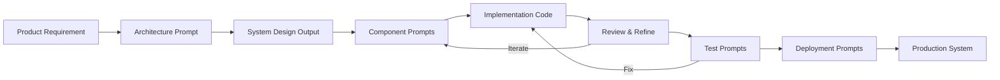

# Building Through Prompting

> A production-grade playbook for technical builders who use AI as their primary development interface.

---

## What This Is

This is an engineering manual — not a prompt cookbook.

It teaches you how to design, build, ship, and maintain real software products where prompting is the primary development workflow. Not a novelty. Not a shortcut. A disciplined engineering practice.

If you've ever:
- Spent 4 hours wrestling a model to produce the right schema
- Got beautiful code on try #1 and garbage on try #2
- Built a prototype in 20 minutes that took 3 days to make production-ready
- Wondered why your prompts "decay" over time

…this playbook exists for you.

---

## Philosophy

### 1. Prompting Is Systems Thinking

A prompt is not a question. It is a **specification**. The quality of your output is bounded by the precision of your specification. Vague specs produce vague systems. In prompting, the same principle applies with zero forgiveness.

### 2. The Model Is a Junior Engineer With Perfect Memory

It knows every API, every pattern, every anti-pattern. What it lacks is **judgment** — the ability to decide *which* pattern fits *this* context. You supply the judgment. The model supplies the velocity.

### 3. Determinism Over Creativity

In production engineering, repeatability matters more than novelty. The goal is to build prompting workflows that produce **consistent, auditable, predictable** output — not to see what cool thing the model invents today.

### 4. Layered Context Is Everything

The single biggest unlock in prompt-driven development is understanding that context is not a single block of text — it is an **architecture**. System prompts, persistent context, ephemeral instructions, code references, examples, constraints — each layer serves a specific function.

### 5. You Are the Architect, Not the Typist

The model writes code. You make decisions. The moment you stop making decisions and start accepting whatever the model generates, you've abdicated your role. Every output must be reviewed through the lens of: *Does this serve the system I'm building?*

---

## High-Level Workflow

### The Build Loop

| Phase | Action | Prompting Role |
|-------|--------|----------------|
| **1. Requirements** | Decompose the product into technical requirements | Translate business language into engineering constraints |
| **2. Architecture** | Design system boundaries, data flow, API contracts | Generate and evaluate architecture options through structured prompts |
| **3. Implementation** | Build backend, frontend, infrastructure | Component-level prompts with full context injection |
| **4. Integration** | Wire systems together | Contract validation, type checking, integration test generation |
| **5. Testing** | Validate correctness, security, performance | Generate test suites, edge cases, adversarial inputs |
| **6. Deployment** | Ship to production | IaC generation, pipeline configuration, monitoring setup |
| **7. Iteration** | Refactor, optimize, extend | Targeted prompts with codebase context for surgical changes |

---

## Playbook Structure

This guide is modular. Each file is self-contained but cross-linked.

| Document | What It Covers |
|----------|----------------|
| [Architecture](./architecture.md) | System design through prompting — monolith vs micro, DB selection, API contracts, scalability, security |
| [Backend](./backend.md) | API design, schema strategy, auth, caching, performance, error handling, testing |
| [Frontend](./frontend.md) | Component systems, state management, API integration, performance, accessibility, design systems |
| [Prompt Engineering](./prompt-engineering.md) | System vs user prompts, constraint layering, output schemas, debugging, versioning, prompt libraries |
| [DevOps](./devops.md) | CI/CD, IaC, deployment pipelines, monitoring, scaling, observability |
| [Application Security](./security.md) | OWASP Web/API/LLM Top 10, input validation, auth hardening, secrets management, threat modeling |
| [AI Coding Tools](./tools.md) | IDE-integrated, standalone, terminal, and specialized tools by budget tier with decision matrices |
| [Workflows](./workflows.md) | End-to-end SaaS build from idea to production, automation, internal tooling |
| [Example Build: InvoiceKit](./example-build.md) | Complete 12-step prompt chain building a real SaaS — from product brief to deploy |

---

## How to Use This Playbook

**If you're starting a new project:**
1. Read [Architecture](./architecture.md) first
2. Then [Prompt Engineering](./prompt-engineering.md) for technique
3. Then the implementation docs ([Backend](./backend.md), [Frontend](./frontend.md)) based on what you're building
4. Finally [DevOps](./devops.md) and [Workflows](./workflows.md) for shipping

**If you're struggling with prompt quality:**
1. Start with [Prompt Engineering](./prompt-engineering.md)
2. Study the templates in each domain-specific doc
3. Build your own prompt library

**If you want to see a real build:**
1. Jump to [Workflows](./workflows.md) for the process and automation patterns
2. Then [Example Build: InvoiceKit](./example-build.md) for a prompt-by-prompt walkthrough of building a complete SaaS

---

## Prerequisites

- You can read code in at least one backend language (Python, TypeScript, Rust, Go, etc.)
- You understand basic system design (databases, APIs, auth)
- You have access to an AI coding assistant (Claude, GPT-4, Gemini, etc.)
- You have opinions about software quality — and the patience to enforce them

---

## Production Checklist

Before considering any project "production-ready" through prompting:

- [ ] Architecture documented and reviewed (not just generated)
- [ ] All generated code has been read and understood by a human
- [ ] Security review completed — auth, input validation, access control
- [ ] Test coverage exists for critical paths
- [ ] Error handling is explicit, not default
- [ ] Database migrations are versioned and reversible
- [ ] Deployment is automated and reproducible
- [ ] Monitoring and alerting are configured
- [ ] Secrets are managed through environment variables, never hardcoded
- [ ] Performance has been benchmarked under realistic load

---

*This playbook is a living document. The prompts that built yesterday's systems will not build tomorrow's. Update your techniques as models evolve, but never update your standards.*