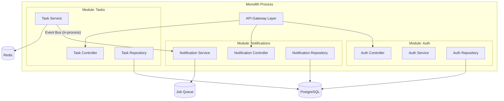
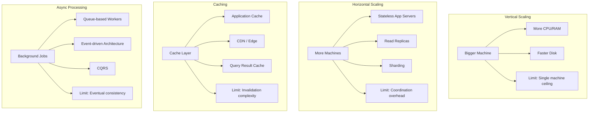

# Architecture Design Through Prompting

> How to translate product requirements into system architecture using AI as your design partner.

← [Back to Index](./README.md) | [Backend →](./backend.md)

---

## The Architecture Prompt Mindset

Architecture is the most consequential phase of any build. A bad schema costs you weeks. A wrong service boundary costs you months. A missing security layer costs you the company.

When prompting for architecture, you are not asking the model to "design a system." You are presenting a **constrained optimization problem** and asking it to evaluate tradeoffs within your specific context.

The model knows every architecture pattern ever documented. Your job is to tell it which constraints matter in your world.

---

## Translating Product Requirements Into Architecture Prompts

### The Requirements Decomposition Template

Before touching architecture, decompose your product into engineering primitives:

```markdown
## Product: [Name]

### Core Entities
- [List every noun in your product — these become tables/models]

### Core Actions  
- [List every verb — these become API endpoints/events]

### Access Patterns
- [Who reads what, how often, with what latency tolerance]

### Volume Estimates
- Users: [count]
- Requests/sec at peak: [estimate]  
- Data growth/month: [estimate]

### Hard Constraints
- [Compliance requirements: GDPR, HIPAA, PCI-DSS]
- [Latency requirements: p99 < X ms]
- [Budget constraints]
- [Team size and skill set]

### Non-Negotiable Quality Attributes
- [Availability target: 99.9%? 99.99%?]
- [Data consistency model: strong? eventual?]
- [Security posture: auth model, encryption requirements]
```

### Example: Translating to an Architecture Prompt

**Bad prompt:**
```
Design the architecture for a task management app.
```

**Production prompt:**
```
You are a senior systems architect. Design the backend architecture for a 
collaborative task management platform with these constraints:

ENTITIES: Users, Workspaces, Projects, Tasks, Comments, Attachments, 
Activity Log

ACCESS PATTERNS:
- 80% reads, 20% writes
- Task listing with filters: p99 < 200ms
- Real-time presence: who is viewing which task
- Activity feed: reverse chronological, per-workspace
- Search across tasks/comments: full-text, p99 < 500ms

SCALE:
- 10K DAU at launch, targeting 100K in 12 months
- Average 50 tasks/user, 3 comments/task
- Peak: 500 concurrent users

CONSTRAINTS:
- Team: 2 backend engineers
- Budget: ≤ $500/month infrastructure at launch
- Must support GDPR data deletion requests
- Mobile + web clients (API-first)

DELIVERABLES:
1. System component diagram (Mermaid)
2. Database schema recommendation with reasoning
3. API boundary definition (what's one service vs split)
4. Technology stack recommendation with tradeoff analysis
5. Data flow for 3 critical paths: task creation, real-time updates, search

For each decision, explain what you'd choose at 10K users vs what you'd 
migrate to at 100K users.
```

---

## Monolith vs Microservices Decision Framework

This is the most over-debated decision in software. Here's the prompting framework that settles it.

### The Decision Prompt

```
Given the following system context, recommend whether to start with a 
monolith or microservices architecture. Justify with specific tradeoffs.

CONTEXT:
- Team size: [N] engineers
- Expected timeline to MVP: [X] weeks
- Domain complexity: [low | medium | high]
- Deployment target: [single region | multi-region]
- Independent scaling needs: [describe which components, if any, have 
  dramatically different scaling profiles]
- Data coupling: [how many entities share foreign keys across boundaries]

CONSTRAINTS:
- Answer MONOLITH if there is no compelling reason to split
- If recommending microservices, define exactly which services and why
- Include migration path from monolith to services if starting monolith
```

### Decision Matrix

| Signal | Monolith | Microservices |
|--------|----------|---------------|
| Team < 5 engineers | ✅ | ❌ |
| Shared database entities | ✅ | ❌ |
| Independent scaling needed | ❌ | ✅ |
| Different deployment cadences | ❌ | ✅ |
| Time to MVP < 8 weeks | ✅ | ❌ |
| Regulatory boundary (PCI/HIPAA) | ❌ | ✅ for isolated service |

**Default answer: Modular monolith.** Split later when you have data proving the need.

### Modular Monolith Architecture



---

## Database Selection Reasoning

### The Database Decision Prompt

```
I need to select a database for the following workload. Recommend a primary 
database and any secondary stores with justification.

WORKLOAD PROFILE:
- Write pattern: [append-heavy | update-heavy | mixed]
- Read pattern: [simple lookups | complex joins | aggregations | full-text search]
- Data model: [highly relational | document-oriented | graph | time-series]
- Consistency requirement: [strong | eventual | varies by operation]
- Transaction requirement: [single-row | multi-row | cross-table | distributed]
- Query complexity: [simple CRUD | complex joins/subqueries | analytics]

VOLUME:
- Current data size: [X GB]
- Growth rate: [X GB/month]
- Read QPS: [X]
- Write QPS: [X]

OPERATIONAL CONSTRAINTS:
- Team expertise: [list known databases]
- Managed service preferred: [yes/no]
- Budget for database: [$X/month]
- Backup/DR requirements: [RPO/RTO targets]

Do not recommend a database just because it's popular. Recommend based on 
workload fit.
```

### Quick Reference

| Workload | Primary Choice | Why |
|----------|---------------|-----|
| Relational data, complex queries, ACID | **PostgreSQL** | Best general-purpose RDBMS. Extensions for everything. |
| Document store, flexible schema, rapid iteration | **MongoDB** | Schema flexibility. But lose joins and constraints. |
| High-write time-series | **TimescaleDB** (Postgres extension) | Time-series on top of Postgres. Best of both worlds. |
| Full-text search | **PostgreSQL `tsvector`** or **Meilisearch** | Postgres handles 80% of search needs. Meilisearch for typo-tolerance. |
| Caching / sessions / rate limiting | **Redis** | Sub-ms reads. But it's memory-bound. |
| Analytics / OLAP | **ClickHouse** or **DuckDB** | Column-oriented. Designed for aggregations over billions of rows. |
| Graph relationships | **Neo4j** or **PostgreSQL `ltree`/recursive CTEs** | Neo4j for deep traversals. Postgres for shallow ones. |

> **Default answer:** PostgreSQL. Add specialized stores only when Postgres demonstrably can't handle the workload.

---

## Scalability Planning

### Capacity Planning Prompt

```
Given this system profile, identify the scaling bottlenecks and recommend 
a scaling strategy for each component.

CURRENT ARCHITECTURE:
[Paste your architecture diagram or description]

CURRENT LOAD:
- [X] requests/second
- [X] database connections
- [X] average response time

PROJECTED LOAD (12 months):
- [Y] requests/second (how you arrived at this number)
- [Y] concurrent users

CONSTRAINTS:
- Budget ceiling: $[X]/month
- Team cannot operate Kubernetes
- Single-region acceptable for now

For each bottleneck:
1. When will it become a problem (at what load)?
2. What's the cheapest mitigation?
3. What's the proper long-term fix?
4. What's the migration path from cheap → proper?
```

### Scaling Strategies Reference



### The Scaling Sequence (What to Do First)

1. **Add caching** — Redis for hot paths, CDN for static assets
2. **Add read replicas** — Route reads to replicas, writes to primary
3. **Add job queues** — Move non-critical work out of the request path
4. **Optimize queries** — Indexes, query rewriting, denormalization
5. **Horizontal app scaling** — Stateless services behind a load balancer
6. **Database sharding** — Only when all above are exhausted

---

## API Contract Design

### The API Design Prompt

```
Design the REST API for [domain]. Follow these constraints:

STANDARDS:
- RESTful resource naming (plural nouns, no verbs in paths)
- JSON:API or consistent envelope format
- Versioned: /api/v1/
- Pagination: cursor-based for lists
- Filtering: query parameters with explicit operators
- Sorting: ?sort=field:asc|desc
- Partial responses: ?fields=id,name,status

AUTHENTICATION:
- Bearer token (JWT)
- Scoped permissions per endpoint

FOR EACH ENDPOINT, PROVIDE:
1. Method + Path
2. Request body schema (if applicable)
3. Response schema with status codes
4. Required permissions
5. Rate limit tier (public, authenticated, admin)
6. Caching strategy (none, short-ttl, long-ttl, stale-while-revalidate)

ENTITIES: [list your entities]

CRITICAL PATHS TO DETAIL:
- [List 3-5 most important user flows]
```

### API Response Envelope (Standard)

```json
{
  "data": { },
  "meta": {
    "request_id": "req_abc123",
    "timestamp": "2026-02-13T06:00:00Z"
  },
  "pagination": {
    "cursor": "eyJpZCI6MTAwfQ==",
    "has_more": true,
    "total": 1432
  },
  "errors": null
}
```

### Error Response Envelope

```json
{
  "data": null,
  "meta": {
    "request_id": "req_abc123",
    "timestamp": "2026-02-13T06:00:00Z"
  },
  "errors": [
    {
      "code": "VALIDATION_ERROR",
      "field": "email",
      "message": "Must be a valid email address",
      "detail": "The value 'not-an-email' does not match the required format"
    }
  ]
}
```

---

## Security and Compliance Considerations

### Security Architecture Prompt

```
Review this architecture for security vulnerabilities. Evaluate against:

1. OWASP Web Top 10
2. OWASP API Top 10
3. Data privacy regulations (GDPR)

ARCHITECTURE:
[Paste architecture description]

AUTH FLOW:
[Describe authentication mechanism]

DATA SENSITIVITY:
- PII fields: [list]
- Payment data: [yes/no, how handled]
- User-generated content: [types]

DEPLOYMENT:
- Cloud provider: [AWS/GCP/Azure]
- Network topology: [public-facing components]

FOR EACH VULNERABILITY FOUND:
1. Severity (Critical/High/Medium/Low)
2. Attack vector
3. Specific mitigation with code example
4. How to verify the fix
```

### Security Architecture Layers

```
┌─────────────────────────────────────────────────┐
│                   CDN / WAF                      │
│         (DDoS protection, bot filtering)         │
├─────────────────────────────────────────────────┤
│              Load Balancer (TLS)                 │
│            (TLS termination, HTTPS only)         │
├─────────────────────────────────────────────────┤
│              API Gateway                         │
│    (Rate limiting, auth validation, CORS)        │
├─────────────────────────────────────────────────┤
│            Application Layer                     │
│  (Input validation, authorization, business      │
│   logic, output encoding, audit logging)         │
├─────────────────────────────────────────────────┤
│             Data Layer                           │
│  (Parameterized queries, encryption at rest,     │
│   row-level security, backup encryption)         │
├─────────────────────────────────────────────────┤
│            Infrastructure                        │
│  (Network segmentation, least-privilege IAM,     │
│   secrets management, container hardening)       │
└─────────────────────────────────────────────────┘
```

### Non-Negotiable Security Decisions

| Decision | Rule | Why |
|----------|------|-----|
| Password storage | bcrypt/argon2, never MD5/SHA | Rainbow tables |
| JWT secrets | RS256, not HS256 in production | Key rotation without redeploying |
| API auth | Per-endpoint authorization checks | BOLA is #1 API vulnerability |
| Database queries | Parameterized only, no string concatenation | SQL injection |
| File uploads | Validate type, size, scan for malware | RCE via file upload |
| CORS | Explicit allowlist, never `*` with credentials | Cross-origin attacks |
| Secrets | Environment variables or vault, never in code | Leaked repos |
| Rate limiting | Per-user, per-endpoint, with backoff | Brute force, DDoS |

---

## Architecture Review Prompt

After generating an architecture, use this review prompt:

```
Act as a principal engineer conducting an architecture review. Evaluate this 
design against these criteria:

DESIGN:
[Paste architecture]

EVALUATION CRITERIA:
1. SINGLE POINTS OF FAILURE — Identify any component whose failure takes 
   down the entire system
2. DATA CONSISTENCY — Are there scenarios where data can become inconsistent?
3. SECURITY BOUNDARIES — Are trust boundaries clearly defined?
4. OPERATIONAL COMPLEXITY — Can a team of [N] operate this?
5. COST EFFICIENCY — Is this over-engineered for the current scale?
6. MIGRATION PATH — Can we evolve this without rewriting?
7. BLAST RADIUS — If component X fails, what's affected?

For each issue found:
- Severity: [Critical | Warning | Note]
- Current risk
- Recommended fix
- Effort to fix: [hours | days | weeks]
```

---

## Common Failure Modes

| Failure | Symptom | Root Cause |
|---------|---------|------------|
| **Premature decomposition** | 12 microservices for a 3-page app | Prompting "best practices" without context constraints |
| **Schema without access patterns** | Beautiful ERD, terrible query performance | Designing schema without specifying how data is read |
| **Missing auth architecture** | Auth bolted on after 50 endpoints exist | Not including security in initial architecture prompt |
| **Over-abstraction** | Repository → Service → Controller → DTO for every entity | Asking for "clean architecture" without specifying when simplicity wins |
| **Technology cargo-culting** | Kubernetes for 100 users | Not constraining recommendations by team size and budget |
| **Ignoring data gravity** | Splitting services that share 80% of their data | Not analyzing entity coupling before drawing service boundaries |

---

## Production Checklist

- [ ] Architecture diagram exists and matches implementation
- [ ] Database choice justified against actual access patterns
- [ ] API contracts documented with request/response schemas
- [ ] Authentication and authorization model defined per-endpoint
- [ ] Scaling bottlenecks identified with mitigation plans
- [ ] Security review completed against OWASP Top 10
- [ ] GDPR/compliance requirements mapped to technical controls
- [ ] Single points of failure identified and mitigated (or accepted with justification)
- [ ] Cost estimate exists for current and projected scale
- [ ] Disaster recovery plan: RPO and RTO defined
- [ ] Runbook exists for common operational scenarios

---

← [Back to Index](./README.md) | [Backend →](./backend.md)
