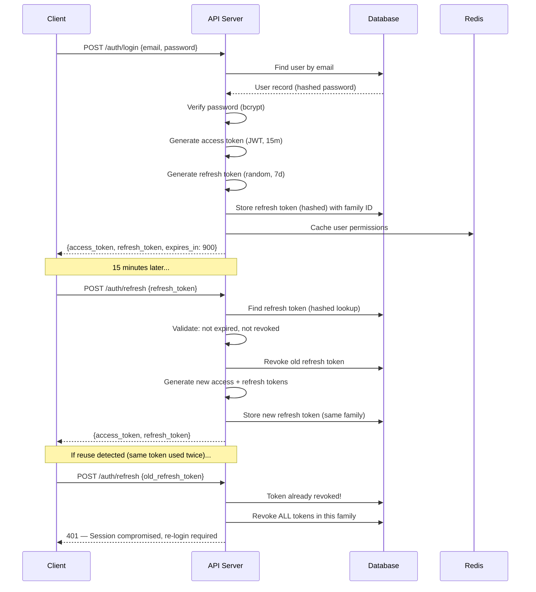

# Backend Development Through Prompting

> From API design to production hardening — building backend systems with AI as your implementation partner.

← [Architecture](./architecture.md) | [Back to Index](./README.md) | [Frontend →](./frontend.md)

---

## The Backend Prompting Pattern

Backend code has a unique property: **it must be correct, not just functional.** A frontend bug shows a misaligned button. A backend bug leaks user data, corrupts transactions, or silently loses writes.

When prompting for backend work, the core principle is:

> **Specify the invariants, not just the behavior.**

"Create a payment endpoint" is a request for behavior.  
"Create a payment endpoint that is idempotent, validates server-side, runs in a transaction, and never stores raw card data" specifies invariants.

---

## Designing REST APIs

### API Design Prompt Template

```
Design a REST API for [resource] in [framework] with these requirements:

RESOURCE: [Name]
FIELDS:
- [field: type, constraints, description]

ENDPOINTS:
- List (paginated, filterable by [fields])
- Get by ID
- Create
- Update (partial)
- Delete (soft)

BUSINESS RULES:
- [Rule 1: e.g., "Only workspace members can create tasks"]
- [Rule 2: e.g., "Completed tasks cannot be edited"]

STANDARDS:
- Cursor-based pagination
- Consistent error envelope
- Input validation with descriptive errors
- Authorization checks per endpoint
- Audit logging for mutations

INCLUDE:
- Route definitions
- Controller/handler code
- Input validation schemas
- Database queries (parameterized)
- Error handling
- Unit test for one happy path and one failure case
```

### Example: Task API (Python / FastAPI)

```python
# schemas/task.py
from pydantic import BaseModel, Field
from enum import Enum
from datetime import datetime
from uuid import UUID

class TaskStatus(str, Enum):
    TODO = "todo"
    IN_PROGRESS = "in_progress"
    DONE = "done"

class TaskCreate(BaseModel):
    title: str = Field(..., min_length=1, max_length=255)
    description: str | None = Field(None, max_length=5000)
    assignee_id: UUID | None = None
    due_date: datetime | None = None
    priority: int = Field(default=0, ge=0, le=3)

class TaskUpdate(BaseModel):
    title: str | None = Field(None, min_length=1, max_length=255)
    description: str | None = Field(None, max_length=5000)
    status: TaskStatus | None = None
    assignee_id: UUID | None = None
    due_date: datetime | None = None
    priority: int | None = Field(None, ge=0, le=3)

class TaskResponse(BaseModel):
    id: UUID
    title: str
    description: str | None
    status: TaskStatus
    assignee_id: UUID | None
    project_id: UUID
    due_date: datetime | None
    priority: int
    created_at: datetime
    updated_at: datetime

    class Config:
        from_attributes = True
```

```python
# routes/tasks.py
from fastapi import APIRouter, Depends, HTTPException, Query
from uuid import UUID

router = APIRouter(prefix="/api/v1/projects/{project_id}/tasks", tags=["tasks"])

@router.get("", response_model=PaginatedResponse[TaskResponse])
async def list_tasks(
    project_id: UUID,
    status: TaskStatus | None = None,
    assignee_id: UUID | None = None,
    cursor: str | None = None,
    limit: int = Query(default=20, le=100),
    current_user: User = Depends(get_current_user),
    db: AsyncSession = Depends(get_db),
):
    # Authorization: user must be a member of the project's workspace
    await authorize_project_access(db, current_user.id, project_id)
    
    tasks, next_cursor = await task_service.list_tasks(
        db,
        project_id=project_id,
        status=status,
        assignee_id=assignee_id,
        cursor=cursor,
        limit=limit,
    )
    
    return PaginatedResponse(
        data=[TaskResponse.from_orm(t) for t in tasks],
        pagination=Pagination(cursor=next_cursor, has_more=next_cursor is not None),
    )

@router.post("", response_model=TaskResponse, status_code=201)
async def create_task(
    project_id: UUID,
    payload: TaskCreate,
    current_user: User = Depends(get_current_user),
    db: AsyncSession = Depends(get_db),
):
    await authorize_project_access(db, current_user.id, project_id)
    
    task = await task_service.create_task(
        db,
        project_id=project_id,
        created_by=current_user.id,
        **payload.model_dump(),
    )
    
    return TaskResponse.from_orm(task)
```

---

## GraphQL API Design

### When to Use GraphQL vs REST

| Signal | REST | GraphQL |
|--------|------|---------|
| Fixed, well-known data shapes | ✅ | Overkill |
| Multiple client types with different data needs | ❌ Over-fetching | ✅ |
| Real-time subscriptions | Requires WebSocket bolt-on | ✅ Built-in |
| Simple CRUD | ✅ | Overkill |
| Deeply nested relational data | N+1 problem | ✅ With DataLoaders |
| Public API for third parties | ✅ Easier to document | ❌ Harder to rate-limit |
| Caching at the HTTP layer | ✅ Native | ❌ Requires persisted queries |

### GraphQL Security Prompt

```
Review this GraphQL schema for security vulnerabilities:

[Paste schema]

Check for:
1. Query depth attacks (recursive queries)
2. Batch query abuse (alias-based)
3. Introspection exposure in production
4. Authorization bypass through resolver chains
5. N+1 query patterns without DataLoaders
6. Mutation input validation gaps

For each issue, provide:
- The attack vector
- A concrete exploit example
- The fix with code
```

---

## Schema Design Strategies

### The Schema Design Prompt

```
Design a PostgreSQL schema for [domain] with these requirements:

ENTITIES: [list with relationships]

ACCESS PATTERNS (ordered by frequency):
1. [Most common query: e.g., "List tasks by project, sorted by created_at"]
2. [Second most common: e.g., "Get task with all comments"]
3. [Third: e.g., "Search tasks by keyword across workspace"]

CONSTRAINTS:
- [Soft delete required for: X, Y]
- [Audit trail required for: Z]
- [Multi-tenant: workspace-scoped isolation]

REQUIREMENTS:
- Include indexes justified by access patterns
- Use UUIDs for primary keys (v7 for sortability)
- Include created_at/updated_at on all tables
- Add CHECK constraints for enums and ranges
- Foreign keys with appropriate ON DELETE behavior
- Comment each non-obvious design decision

OUTPUT FORMAT:
- SQL DDL
- Mermaid ER diagram
- Index justification table
```

### Schema Design Principles

```sql
-- PRINCIPLE 1: Constraints belong in the database, not just the app
CREATE TABLE tasks (
    id          UUID PRIMARY KEY DEFAULT gen_random_uuid(),
    title       VARCHAR(255) NOT NULL CHECK (length(trim(title)) > 0),
    status      VARCHAR(20) NOT NULL DEFAULT 'todo' 
                CHECK (status IN ('todo', 'in_progress', 'done', 'archived')),
    priority    SMALLINT NOT NULL DEFAULT 0 CHECK (priority BETWEEN 0 AND 3),
    project_id  UUID NOT NULL REFERENCES projects(id) ON DELETE CASCADE,
    assignee_id UUID REFERENCES users(id) ON DELETE SET NULL,
    due_date    TIMESTAMPTZ,
    created_by  UUID NOT NULL REFERENCES users(id) ON DELETE RESTRICT,
    created_at  TIMESTAMPTZ NOT NULL DEFAULT now(),
    updated_at  TIMESTAMPTZ NOT NULL DEFAULT now(),
    deleted_at  TIMESTAMPTZ  -- soft delete
);

-- PRINCIPLE 2: Indexes are justified by access patterns, not guesswork
CREATE INDEX idx_tasks_project_status ON tasks(project_id, status) 
    WHERE deleted_at IS NULL;  -- partial index: only active tasks

CREATE INDEX idx_tasks_assignee ON tasks(assignee_id) 
    WHERE deleted_at IS NULL AND assignee_id IS NOT NULL;

CREATE INDEX idx_tasks_due_date ON tasks(due_date) 
    WHERE deleted_at IS NULL AND due_date IS NOT NULL;

-- PRINCIPLE 3: Full-text search on PostgreSQL
ALTER TABLE tasks ADD COLUMN search_vector tsvector 
    GENERATED ALWAYS AS (
        setweight(to_tsvector('english', coalesce(title, '')), 'A') ||
        setweight(to_tsvector('english', coalesce(description, '')), 'B')
    ) STORED;

CREATE INDEX idx_tasks_search ON tasks USING gin(search_vector);
```

### Migration Prompt

```
Write a database migration for [change description].

CURRENT SCHEMA:
[Relevant tables]

CHANGE:
[What needs to change]

REQUIREMENTS:
- Migration must be reversible (include DOWN migration)
- Must not lock tables for more than 1 second
- Must handle existing data (provide data migration if needed)
- Use CREATE INDEX CONCURRENTLY for new indexes
- Include a comment explaining why this change is needed
```

---

## Auth Systems

### Auth Architecture Prompt

```
Design an authentication and authorization system with these requirements:

AUTH METHOD: [Email/password + OAuth + magic link]
TOKEN STRATEGY: [JWT access + refresh token rotation]
AUTHORIZATION MODEL: [RBAC with these roles: owner, admin, member, viewer]

FLOWS TO IMPLEMENT:
1. Registration
2. Login (email/password)
3. OAuth callback (Google)
4. Token refresh
5. Password reset
6. Email verification
7. Session revocation

SECURITY REQUIREMENTS:
- Access token: 15-minute expiry, RS256 signed
- Refresh token: 7-day expiry, stored hashed in DB, rotated on use
- Failed login: progressive delay (1s, 2s, 4s, 8s, max 30s)
- Password: bcrypt, minimum 10 characters, breach database check
- CSRF protection for cookie-based auth
- Device fingerprinting for anomaly detection

PROVIDE:
- Token structure (JWT claims)
- Database tables for auth
- Middleware/guard implementation
- Complete flow diagrams for login and token refresh
```

### Token Structure

```json
// Access Token (short-lived, stateless)
{
  "sub": "usr_abc123",           // User ID
  "wid": "ws_def456",           // Active workspace
  "role": "admin",               // Workspace role
  "scopes": ["read", "write"],   // Permission scopes
  "iat": 1707800000,
  "exp": 1707800900,             // 15 minutes
  "jti": "tok_unique_id"         // For revocation checks
}

// Refresh Token (long-lived, stored in DB)
{
  "sub": "usr_abc123",
  "family": "fam_xyz789",       // Token family for rotation detection
  "iat": 1707800000,
  "exp": 1708404800              // 7 days
}
```

### Auth Flow



---

## Caching Strategies

### Caching Decision Prompt

```
Analyze these API endpoints and recommend caching strategies:

ENDPOINTS:
[List endpoints with read/write patterns and latency requirements]

DATA CHARACTERISTICS:
- Update frequency: [how often does data change]
- Consistency tolerance: [can users see stale data? for how long?]
- Personalization: [is response user-specific?]

INFRASTRUCTURE:
- Cache layer: Redis
- CDN available: [yes/no]

FOR EACH ENDPOINT, RECOMMEND:
1. Cache layer (application / CDN / none)
2. Cache key pattern
3. TTL with justification
4. Invalidation strategy (time-based / event-based / hybrid)
5. Cache stampede prevention approach
```

### Caching Patterns Reference

```python
# Pattern 1: Cache-Aside (most common)
async def get_task(task_id: UUID) -> Task:
    cache_key = f"task:{task_id}"
    
    # Try cache first
    cached = await redis.get(cache_key)
    if cached:
        return Task.model_validate_json(cached)
    
    # Cache miss: query DB
    task = await db.get(Task, task_id)
    if not task:
        raise NotFoundError(f"Task {task_id}")
    
    # Store in cache with TTL
    await redis.setex(cache_key, 300, task.model_dump_json())  # 5 min TTL
    return task

# Pattern 2: Write-Through (update cache on write)
async def update_task(task_id: UUID, data: TaskUpdate) -> Task:
    async with db.begin():
        task = await db.get(Task, task_id, with_for_update=True)
        for field, value in data.model_dump(exclude_unset=True).items():
            setattr(task, field, value)
        task.updated_at = datetime.utcnow()
    
    # Update cache immediately
    cache_key = f"task:{task_id}"
    await redis.setex(cache_key, 300, task.model_dump_json())
    
    # Invalidate list caches
    await redis.delete(f"task_list:{task.project_id}:*")
    
    return task

# Pattern 3: Cache Stampede Prevention
async def get_popular_data(key: str) -> dict:
    cached = await redis.get(key)
    if cached:
        data = json.loads(cached)
        # Probabilistic early expiration
        ttl = await redis.ttl(key)
        if ttl > 10 or random.random() > 0.1:  # 90% serve from cache
            return data
    
    # Distributed lock to prevent stampede
    lock_key = f"lock:{key}"
    acquired = await redis.set(lock_key, "1", nx=True, ex=5)
    
    if not acquired:
        # Another process is refreshing — wait or serve stale
        await asyncio.sleep(0.1)
        return json.loads(await redis.get(key))  # serve potentially stale
    
    try:
        fresh_data = await expensive_query()
        await redis.setex(key, 600, json.dumps(fresh_data))
        return fresh_data
    finally:
        await redis.delete(lock_key)
```

---

## Performance Tuning via Prompting

### Performance Analysis Prompt

```
Analyze this endpoint for performance bottlenecks:

CODE:
[Paste endpoint code]

QUERY:
[Paste SQL query]

OBSERVED BEHAVIOR:
- Average response time: [X ms]
- p99 response time: [X ms]
- Database query time: [X ms]
- Under load: [behavior at high concurrency]

TABLE SIZES:
[Relevant table row counts]

INDEXES:
[Existing indexes]

IDENTIFY:
1. N+1 query patterns
2. Missing indexes (with EXPLAIN ANALYZE output if available)
3. Unnecessary data fetching
4. Serialization overhead
5. Connection pool issues
6. Lock contention points

FOR EACH ISSUE:
- Impact estimation (how much will fixing this improve p99?)
- Fix with code
- How to verify the improvement
```

### The N+1 Query Killer

```python
# BAD: N+1 — This hits the database once for tasks + N times for assignees
tasks = await db.execute(select(Task).where(Task.project_id == project_id))
for task in tasks:
    assignee = await db.execute(
        select(User).where(User.id == task.assignee_id)
    )  # N additional queries!

# GOOD: Eager loading — single query with JOIN
tasks = await db.execute(
    select(Task)
    .options(selectinload(Task.assignee))
    .where(Task.project_id == project_id)
)

# GOOD: Manual batching — 2 queries regardless of N
tasks = await db.execute(
    select(Task).where(Task.project_id == project_id)
)
task_list = tasks.scalars().all()

assignee_ids = {t.assignee_id for t in task_list if t.assignee_id}
assignees = await db.execute(
    select(User).where(User.id.in_(assignee_ids))
)
assignee_map = {u.id: u for u in assignees.scalars().all()}
```

---

## Error Handling Patterns

### Error Handling Architecture

```python
# errors.py — Centralized error definitions
from enum import Enum

class ErrorCode(str, Enum):
    VALIDATION_ERROR = "VALIDATION_ERROR"
    NOT_FOUND = "NOT_FOUND"
    UNAUTHORIZED = "UNAUTHORIZED"
    FORBIDDEN = "FORBIDDEN"
    CONFLICT = "CONFLICT"
    RATE_LIMITED = "RATE_LIMITED"
    INTERNAL_ERROR = "INTERNAL_ERROR"

class AppError(Exception):
    def __init__(
        self,
        code: ErrorCode,
        message: str,
        status_code: int = 400,
        field: str | None = None,
        detail: str | None = None,
    ):
        self.code = code
        self.message = message
        self.status_code = status_code
        self.field = field
        self.detail = detail

class NotFoundError(AppError):
    def __init__(self, resource: str, identifier: str | None = None):
        detail = f"{resource} not found"
        if identifier:
            detail = f"{resource} with id '{identifier}' not found"
        super().__init__(
            code=ErrorCode.NOT_FOUND,
            message=detail,
            status_code=404,
        )

class ForbiddenError(AppError):
    def __init__(self, action: str = "perform this action"):
        super().__init__(
            code=ErrorCode.FORBIDDEN,
            message=f"You do not have permission to {action}",
            status_code=403,
        )

# middleware.py — Global error handler
@app.exception_handler(AppError)
async def app_error_handler(request: Request, exc: AppError):
    return JSONResponse(
        status_code=exc.status_code,
        content={
            "data": None,
            "errors": [{
                "code": exc.code.value,
                "message": exc.message,
                "field": exc.field,
                "detail": exc.detail,
            }],
            "meta": {
                "request_id": request.state.request_id,
                "timestamp": datetime.utcnow().isoformat(),
            },
        },
    )

@app.exception_handler(Exception)
async def unhandled_error_handler(request: Request, exc: Exception):
    # Log the full error internally
    logger.error(
        "Unhandled exception",
        exc_info=exc,
        extra={"request_id": request.state.request_id},
    )
    
    # Return generic error to client — never leak internals
    return JSONResponse(
        status_code=500,
        content={
            "data": None,
            "errors": [{
                "code": "INTERNAL_ERROR",
                "message": "An unexpected error occurred",
                "detail": None,
            }],
            "meta": {
                "request_id": request.state.request_id,
                "timestamp": datetime.utcnow().isoformat(),
            },
        },
    )
```

---

## Testing Strategies

### Test Generation Prompt

```
Generate tests for this endpoint:

ENDPOINT: [method, path, handler code]
BUSINESS RULES: [list rules]

GENERATE:
1. Happy path tests (valid input → expected output)
2. Validation tests (invalid inputs → proper error responses)
3. Authorization tests (wrong role → 403, no auth → 401)
4. Edge cases (empty lists, max values, concurrent access)
5. Integration test with real database (use test fixtures)

FRAMEWORK: pytest + httpx (async)
DATABASE: PostgreSQL test instance (transactions rolled back per test)

PATTERNS:
- Use factory functions for test data, not raw dicts
- Assert response status AND body structure
- Test error messages are user-friendly (no stack traces)
- Test pagination boundaries
```

### Test Structure

```python
# tests/conftest.py
import pytest
from httpx import AsyncClient

@pytest.fixture
async def client(test_app):
    async with AsyncClient(app=test_app, base_url="http://test") as ac:
        yield ac

@pytest.fixture
async def authenticated_client(client, test_user):
    token = create_access_token(user_id=test_user.id)
    client.headers["Authorization"] = f"Bearer {token}"
    return client

@pytest.fixture
async def test_user(db):
    return await UserFactory.create(db, email="test@example.com")

@pytest.fixture
async def test_project(db, test_user):
    workspace = await WorkspaceFactory.create(db, owner_id=test_user.id)
    return await ProjectFactory.create(db, workspace_id=workspace.id)


# tests/test_tasks.py
class TestCreateTask:
    async def test_create_task_success(self, authenticated_client, test_project):
        response = await authenticated_client.post(
            f"/api/v1/projects/{test_project.id}/tasks",
            json={"title": "Ship feature", "priority": 2},
        )
        assert response.status_code == 201
        data = response.json()["data"]
        assert data["title"] == "Ship feature"
        assert data["priority"] == 2
        assert data["status"] == "todo"
        assert data["project_id"] == str(test_project.id)

    async def test_create_task_empty_title_rejected(self, authenticated_client, test_project):
        response = await authenticated_client.post(
            f"/api/v1/projects/{test_project.id}/tasks",
            json={"title": ""},
        )
        assert response.status_code == 422
        errors = response.json()["errors"]
        assert any(e["field"] == "title" for e in errors)

    async def test_create_task_unauthorized(self, client, test_project):
        """No auth header → 401"""
        response = await client.post(
            f"/api/v1/projects/{test_project.id}/tasks",
            json={"title": "Sneaky task"},
        )
        assert response.status_code == 401

    async def test_create_task_wrong_project(self, authenticated_client):
        """User doesn't belong to project → 403"""
        other_project_id = uuid4()
        response = await authenticated_client.post(
            f"/api/v1/projects/{other_project_id}/tasks",
            json={"title": "Nope"},
        )
        assert response.status_code == 403

    async def test_create_task_priority_bounds(self, authenticated_client, test_project):
        """Priority > 3 → validation error"""
        response = await authenticated_client.post(
            f"/api/v1/projects/{test_project.id}/tasks",
            json={"title": "Test", "priority": 99},
        )
        assert response.status_code == 422
```

---

## Common Failure Modes

| Failure | Symptom | Root Cause |
|---------|---------|------------|
| **No input validation** | Model generates endpoints without Pydantic/Zod schemas | Prompt didn't specify "validate all inputs with schemas" |
| **String concatenation in SQL** | `f"SELECT * FROM users WHERE id = '{user_id}'"` | Model defaults to simple patterns. Always specify "parameterized queries only" |
| **Missing authorization** | Any authenticated user can access any resource | Prompt asked for "auth" but not "per-resource authorization" |
| **Synchronous I/O in async** | Event loop blocked, latency spikes | Model mixed sync DB calls in async handlers. Specify async stack explicitly |
| **No error envelope** | Inconsistent error formats across endpoints | Each endpoint handles errors independently. Specify global error handler |
| **Hardcoded secrets** | `JWT_SECRET = "supersecret123"` in source | Model demonstrates with hardcoded values. Always specify "env vars for secrets" |
| **No pagination** | Endpoint returns 50K rows | Prompt didn't mention pagination. Always specify limits |
| **Missing indexes** | Queries slow at scale | Schema designed without access patterns. Always specify top queries |

---

## Production Checklist

- [ ] All endpoints have input validation schemas
- [ ] Authorization checked per endpoint, per resource (not just authentication)
- [ ] Database queries are parameterized (no string concatenation)
- [ ] All secrets loaded from environment variables
- [ ] Error responses follow consistent envelope format
- [ ] No internal details leaked in error messages
- [ ] Rate limiting configured per endpoint tier
- [ ] Pagination enforced on all list endpoints
- [ ] Database migrations are versioned and reversible
- [ ] Indexes exist for every access pattern
- [ ] Connection pool configured with appropriate limits
- [ ] Health check endpoint exists and checks DB connectivity
- [ ] Request logging includes request ID for tracing
- [ ] Graceful shutdown handles in-flight requests
- [ ] Test coverage exists for all critical paths
- [ ] Soft delete implemented where required
- [ ] CORS configured with explicit allowlist

---

← [Architecture](./architecture.md) | [Back to Index](./README.md) | [Frontend →](./frontend.md)
