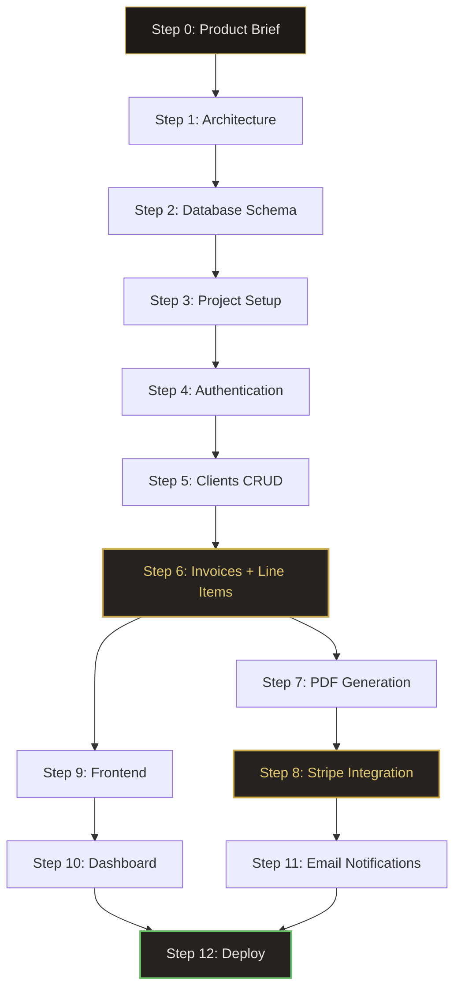

# Example Build: InvoiceKit

> A complete SaaS built prompt-by-prompt — from idea to production in 12 steps.

← [Workflows](./workflows.md) | [Back to Index](./README.md)

---

## The Product

**InvoiceKit** — a SaaS for freelancers and small agencies to create, send, and track invoices. Receive payments via Stripe. Generate PDF invoices. Track outstanding balances.

### Why This Example?

It exercises every layer of the stack:
- Authentication with workspaces
- CRUD with business logic (tax calculations, status transitions)
- File generation (PDF invoices)
- Third-party integration (Stripe, email)
- Dashboard with analytics
- Multi-tenant data isolation

### The Rules

1. Every step has **one prompt**
2. Each prompt builds on the output of the previous step
3. Review notes tell you what to verify before moving on
4. The entire build takes **~35 prompts** over **3 weeks**

---

## Step 0 — Define the Product

> Before prompting anything, write down what you're building. Not for the model — for yourself.

### Product Brief (You Write This)

```markdown
# InvoiceKit — Product Brief

## One-liner
Invoice management for freelancers who hate invoicing.

## Users
Solo freelancers and small agencies (1-5 people).

## Core flows
1. Freelancer signs up → creates workspace
2. Adds clients (name, email, address, tax ID)
3. Creates invoice → adds line items → sets due date
4. Sends invoice via email (PDF attached)
5. Client pays via Stripe payment link
6. Freelancer sees payment status update in real-time
7. Dashboard shows: outstanding, paid this month, overdue

## Revenue model
Free tier: 5 invoices/month
Pro: $12/month unlimited

## MVP scope (what to build)
- Auth (email/password)
- Client management (CRUD)
- Invoice creation with line items
- PDF generation
- Email sending
- Stripe payment links
- Dashboard with key metrics

## NOT in MVP
- Team/multi-user workspaces
- Recurring invoices
- Multi-currency
- Custom branding/templates
- Mobile app
```

**No prompt needed.** This is your thinking. Now you're ready.

---

## Step 1 — Architecture

### The Prompt

```
You are a senior systems architect. Design the backend architecture for 
InvoiceKit — an invoice management SaaS for freelancers.

PRODUCT:
- Users create and manage clients
- Users create invoices with line items
- Invoices are sent via email with PDF attachment
- Clients pay via Stripe payment link embedded in invoice
- Dashboard shows outstanding, paid, and overdue totals

ENTITIES: Users, Clients, Invoices, LineItems, Payments

SCALE:
- Launch: 500 users, ~2K invoices/month
- 12 months: 5K users, ~20K invoices/month
- Average invoice: 3-5 line items

CONSTRAINTS:
- Solo developer
- Budget: ≤ $100/month infrastructure
- MVP in 3 weeks
- Must handle money correctly (no floating point for currency)

DELIVER:
1. Architecture diagram (Mermaid)
2. Technology stack with justification
3. Database recommendation
4. Service boundaries (or confirm monolith)
5. Third-party integrations list
6. What to build first (priority order)
```

### What You Get

The model returns a modular monolith (correct for solo dev), recommends:
- **Backend:** Python + FastAPI
- **Database:** PostgreSQL (money needs NUMERIC, not FLOAT)
- **Queue:** Redis + background workers (for PDF gen and email)
- **Storage:** S3-compatible (for PDF storage)
- **Payments:** Stripe Checkout Sessions
- **Email:** Resend or AWS SES
- **Frontend:** React + Vite

### Review Checklist

- [ ] Confirmed monolith (not microservices for a solo dev)
- [ ] Currency stored as integer cents (not float/decimal in app layer)
- [ ] PDF generation is async (not blocking the request)
- [ ] Stripe webhook handler is specified for payment confirmation
- [ ] Email sending is async via queue

**→ Continue to Step 2**

---

## Step 2 — Database Schema

### The Prompt

```
Generate the PostgreSQL schema for InvoiceKit based on this architecture:
[Paste Step 1 output]

ENTITIES:
- User: email, password_hash, business_name, business_address, tax_id
- Client: belongs to User. name, email, address, tax_id, notes
- Invoice: belongs to User, references Client.
  invoice_number (auto-incrementing per user), status (draft/sent/paid/overdue/cancelled),
  issue_date, due_date, subtotal_cents, tax_rate, tax_amount_cents,
  total_cents, currency (default USD), notes, pdf_url, stripe_payment_link
- LineItem: belongs to Invoice. description, quantity, unit_price_cents, total_cents
- Payment: belongs to Invoice. amount_cents, stripe_payment_intent_id,
  paid_at, status (succeeded/failed/refunded)

CRITICAL RULES:
- ALL monetary values stored as INTEGER (cents). No FLOAT. No DECIMAL in app.
- invoice_number is unique per user (not globally)
- Soft delete on invoices
- Indexes for: invoices by user+status, invoices by due_date (for overdue detection)

OUTPUT:
1. SQL DDL with constraints
2. ER diagram (Mermaid)
3. Index justification
4. First migration file
```

### What You Get

```sql
-- Core of what the model generates (abbreviated)

CREATE TABLE invoices (
    id            UUID PRIMARY KEY DEFAULT gen_random_uuid(),
    user_id       UUID NOT NULL REFERENCES users(id) ON DELETE CASCADE,
    client_id     UUID NOT NULL REFERENCES clients(id) ON DELETE RESTRICT,
    invoice_number INTEGER NOT NULL,
    status        VARCHAR(20) NOT NULL DEFAULT 'draft'
                  CHECK (status IN ('draft','sent','paid','overdue','cancelled')),
    issue_date    DATE NOT NULL DEFAULT CURRENT_DATE,
    due_date      DATE NOT NULL,
    subtotal_cents INTEGER NOT NULL DEFAULT 0 CHECK (subtotal_cents >= 0),
    tax_rate      NUMERIC(5,4) NOT NULL DEFAULT 0 CHECK (tax_rate >= 0 AND tax_rate <= 1),
    tax_amount_cents INTEGER NOT NULL DEFAULT 0 CHECK (tax_amount_cents >= 0),
    total_cents   INTEGER NOT NULL DEFAULT 0 CHECK (total_cents >= 0),
    currency      CHAR(3) NOT NULL DEFAULT 'USD',
    notes         TEXT,
    pdf_url       TEXT,
    stripe_payment_link TEXT,
    created_at    TIMESTAMPTZ NOT NULL DEFAULT now(),
    updated_at    TIMESTAMPTZ NOT NULL DEFAULT now(),
    deleted_at    TIMESTAMPTZ,
    
    UNIQUE (user_id, invoice_number)
);

CREATE TABLE line_items (
    id              UUID PRIMARY KEY DEFAULT gen_random_uuid(),
    invoice_id      UUID NOT NULL REFERENCES invoices(id) ON DELETE CASCADE,
    description     VARCHAR(500) NOT NULL CHECK (length(trim(description)) > 0),
    quantity        NUMERIC(10,2) NOT NULL CHECK (quantity > 0),
    unit_price_cents INTEGER NOT NULL CHECK (unit_price_cents >= 0),
    total_cents     INTEGER NOT NULL CHECK (total_cents >= 0),
    sort_order      SMALLINT NOT NULL DEFAULT 0,
    created_at      TIMESTAMPTZ NOT NULL DEFAULT now()
);
```

### Review Checklist

- [ ] All monetary fields are `INTEGER` (cents) — no FLOAT anywhere
- [ ] `invoice_number` is `UNIQUE(user_id, invoice_number)` not globally unique
- [ ] `ON DELETE RESTRICT` on client (can't delete client with invoices)
- [ ] `ON DELETE CASCADE` on line_items (delete invoice → delete items)
- [ ] `tax_rate` is NUMERIC(5,4) allowing values like 0.0725 (7.25%)
- [ ] CHECK constraints prevent negative amounts
- [ ] Soft delete on invoices (deleted_at)
- [ ] Indexes exist for user+status and due_date queries

**→ Continue to Step 3**

---

## Step 3 — Project Setup

### The Prompt

```
Set up the FastAPI project structure for InvoiceKit.

STRUCTURE:
src/
├── main.py              # FastAPI app, middleware, startup
├── config.py            # Settings from env vars
├── database.py          # Async SQLAlchemy setup
├── auth/                # Auth module
├── clients/             # Clients module  
├── invoices/            # Invoices module (includes line items)
├── payments/            # Stripe integration
├── notifications/       # Email sending
├── pdf/                 # PDF generation
├── common/              # Shared utilities
│   ├── errors.py        # Error classes
│   ├── schemas.py       # Base response envelope
│   └── dependencies.py  # Shared FastAPI dependencies
└── workers/             # Background job definitions

GENERATE:
1. src/main.py — App with CORS, error handlers, request ID middleware
2. src/config.py — Pydantic Settings with all env vars
3. src/database.py — Async SQLAlchemy 2.0 engine + session
4. src/common/errors.py — AppError hierarchy
5. src/common/schemas.py — Response envelope
6. requirements.txt
7. .env.example
8. Dockerfile (production-ready)
9. docker-compose.yml (local dev with Postgres + Redis)
```

### Review Checklist

- [ ] All secrets in `.env.example` with placeholder values
- [ ] Dockerfile is multi-stage, non-root
- [ ] docker-compose has health checks on Postgres and Redis
- [ ] Config validates required env vars at startup (fail fast)
- [ ] CORS origins configurable via env var

**→ Continue to Step 4**

---

## Step 4 — Authentication

### The Prompt

```
Implement auth for InvoiceKit following the project structure from Step 3.

FLOWS:
1. POST /api/v1/auth/register — email, password, business_name
2. POST /api/v1/auth/login — email, password → tokens
3. POST /api/v1/auth/refresh — refresh token → new tokens
4. GET /api/v1/auth/me — current user profile
5. PATCH /api/v1/auth/me — update business info

TOKEN: JWT access (15min) + refresh rotation (7 days)
PASSWORD: bcrypt, minimum 10 chars

GENERATE:
- src/auth/schemas.py
- src/auth/service.py
- src/auth/routes.py
- src/auth/dependencies.py (get_current_user)
- tests/test_auth.py

Follow the existing patterns from common/errors.py and common/schemas.py.
Include rate limiting on login: 5 attempts/minute per IP.
```

### Review Checklist

- [ ] Password never returned in any response
- [ ] Login error doesn't distinguish "wrong email" from "wrong password"
- [ ] Refresh token stored hashed in DB
- [ ] Refresh token rotation (old token invalidated on use)

**→ Continue to Step 5**

---

## Step 5 — Clients CRUD

### The Prompt

```
Implement the Clients resource for InvoiceKit.

FOLLOW the exact same patterns as the auth module for code style.

RESOURCE: Client (belongs to authenticated user)
FIELDS: name, email, address, tax_id, notes

ENDPOINTS:
- GET    /api/v1/clients         — list with search + pagination
- POST   /api/v1/clients         — create
- GET    /api/v1/clients/{id}    — get (with invoice count)
- PATCH  /api/v1/clients/{id}    — update
- DELETE /api/v1/clients/{id}    — delete (blocked if has invoices)

AUTHORIZATION: Users can only access their own clients.

GENERATE: schemas.py, service.py, routes.py, tests.
```

### Review Checklist

- [ ] All queries filter by `user_id` (no BOLA vulnerability)
- [ ] DELETE returns 409 if client has invoices
- [ ] Search works on name and email
- [ ] Pagination is cursor-based

**→ Continue to Step 6**

---

## Step 6 — Invoices + Line Items

### The Prompt

```
Implement the Invoices resource for InvoiceKit. This is the core domain.

RESOURCE: Invoice (belongs to User, references Client)

ENDPOINTS:
- GET    /api/v1/invoices                   — list with filters (status, client, date range)
- POST   /api/v1/invoices                   — create (draft)
- GET    /api/v1/invoices/{id}              — get with line items
- PATCH  /api/v1/invoices/{id}              — update (only if draft)
- DELETE /api/v1/invoices/{id}              — soft delete (only if draft)
- POST   /api/v1/invoices/{id}/send         — transition draft → sent (triggers email + PDF)
- POST   /api/v1/invoices/{id}/mark-paid    — manual mark as paid
- POST   /api/v1/invoices/{id}/line-items   — add line item
- PATCH  /api/v1/invoices/{id}/line-items/{item_id} — update line item
- DELETE /api/v1/invoices/{id}/line-items/{item_id} — remove line item

BUSINESS RULES:
1. invoice_number auto-increments per user (SELECT MAX + 1 in transaction)
2. Adding/updating/removing line items recalculates:
   subtotal_cents = SUM(line_item.total_cents)
   tax_amount_cents = ROUND(subtotal_cents * tax_rate)
   total_cents = subtotal_cents + tax_amount_cents
3. Sent invoices cannot be edited (only cancelled)
4. Paid invoices cannot be modified at all
5. All calculations in integer cents — NO floating point

CRITICAL — MONEY HANDLING:
- line_item.total_cents = quantity * unit_price_cents (rounded to int)
- All arithmetic in Python uses integers only
- Never convert to float for calculations
- Format for display: total_cents / 100 → "1,234.56" (display only, never stored)

GENERATE: schemas.py, service.py, routes.py, tests.
Include a test that verifies cent-precision arithmetic with known values.
```

### What You Get

The model produces the invoice CRUD with the critical integer arithmetic:

```python
# Correct money handling (what the model should generate)
def calculate_line_item_total(quantity: Decimal, unit_price_cents: int) -> int:
    """Calculate line item total in cents. Uses Decimal for intermediate precision."""
    total = quantity * Decimal(unit_price_cents)
    return int(total.quantize(Decimal('1'), rounding=ROUND_HALF_UP))

def recalculate_invoice_totals(invoice: Invoice, line_items: list[LineItem]) -> None:
    """Recalculate invoice totals from line items. All in cents."""
    invoice.subtotal_cents = sum(item.total_cents for item in line_items)
    # tax_rate is stored as Decimal (e.g., 0.0725 for 7.25%)
    tax = Decimal(invoice.subtotal_cents) * invoice.tax_rate
    invoice.tax_amount_cents = int(tax.quantize(Decimal('1'), rounding=ROUND_HALF_UP))
    invoice.total_cents = invoice.subtotal_cents + invoice.tax_amount_cents
```

### Review Checklist

- [ ] Zero floating point in any money calculation
- [ ] `invoice_number` generation uses `SELECT ... FOR UPDATE` to prevent race conditions
- [ ] Status transitions are enforced (can't edit sent invoices)
- [ ] Recalculation happens inside a transaction
- [ ] Line item deletion recalculates parent invoice
- [ ] Test verifies: 3 items × $33.33 = $99.99 (not $99.98 or $100.00)

**→ Continue to Step 7**

---

## Step 7 — PDF Generation

### The Prompt

```
Implement PDF invoice generation for InvoiceKit.

TRIGGER: When invoice status transitions from draft → sent

FLOW:
1. Invoice send endpoint called
2. Generate PDF from invoice data
3. Upload PDF to S3-compatible storage
4. Store PDF URL on invoice record
5. Send email to client with PDF attached

PDF CONTENT:
- Header: User's business name, address, tax ID
- Client: name, address, tax ID
- Invoice number, issue date, due date
- Line items table: description, quantity, unit price, total
- Subtotal, tax, total
- Payment link (Stripe)
- "Thank you" footer

IMPLEMENTATION:
- Use `weasyprint` or `reportlab` for PDF generation
- Run in background worker (not in request path)
- Use arq (async Redis queue) for job processing

GENERATE:
1. src/pdf/generator.py — PDF rendering
2. src/pdf/templates/invoice.html — HTML template for PDF
3. src/workers/tasks.py — Background job definitions
4. src/workers/settings.py — arq worker config
5. S3 upload utility

Keep the HTML template clean — CSS for layout, no JavaScript.
```

### Review Checklist

- [ ] PDF generation runs in background worker (not blocking HTTP)
- [ ] PDF template displays all monetary values formatted from cents
- [ ] S3 upload uses a content-addressed key (hash-based, not guessable)
- [ ] PDF URL is a signed URL or behind auth (not publicly guessable)

**→ Continue to Step 8**

---

## Step 8 — Stripe Integration

### The Prompt

```
Implement Stripe payment integration for InvoiceKit.

FLOW:
1. When invoice is sent → create Stripe Payment Link for the total
2. Payment link is embedded in the invoice email and PDF
3. When client pays → Stripe sends webhook → update invoice status to "paid"
4. Record payment in payments table

IMPLEMENTATION:
- Use Stripe Checkout Sessions (not custom payment form — no PCI scope)
- Webhook endpoint: POST /api/v1/webhooks/stripe
- Webhook signature verification (CRITICAL)
- Idempotent payment recording (same payment_intent → same record)

STRIPE EVENTS TO HANDLE:
- checkout.session.completed → create Payment, update Invoice status
- payment_intent.payment_failed → log failure

SECURITY:
- Webhook endpoint verifies Stripe signature header
- No auth middleware on webhook endpoint (Stripe can't authenticate)
- Idempotency: check if payment already recorded before creating
- Never log full Stripe event payload (contains PII)

GENERATE:
1. src/payments/service.py — Payment recording logic
2. src/payments/routes.py — Webhook handler
3. src/payments/stripe_client.py — Stripe API wrapper
4. tests/test_stripe_webhook.py — Test with mock Stripe events

CRITICAL: The webhook handler must return 200 quickly.
Do heavy processing (email notification, etc.) in background worker.
```

### Review Checklist

- [ ] Webhook verifies `Stripe-Signature` header before processing
- [ ] Payment recording is idempotent (same intent → no duplicate)
- [ ] Webhook returns 200 immediately, queues side effects
- [ ] Stripe secret key from environment variable
- [ ] No raw card data touches your server (Checkout Sessions handle PCI)
- [ ] Failed payments don't change invoice status

**→ Continue to Step 9**

---

## Step 9 — Frontend

### The Prompt

```
Build the React frontend for InvoiceKit.

STACK: React 19, Vite, TypeScript, TanStack Query, Zustand, shadcn/ui

AESTHETIC: Clean, professional, warm. This is a financial tool — 
it should feel trustworthy and precise. Think: Notion meets Stripe 
Dashboard. Warm neutrals with a single accent color.

PAGES:
1. /login — email/password
2. /register — email, password, business name
3. /dashboard — key metrics (outstanding, paid this month, overdue count)
4. /clients — client list with search
5. /clients/new — create client form
6. /invoices — invoice list with status filters
7. /invoices/new — create invoice (select client, add line items, preview)
8. /invoices/:id — invoice detail (view, send, mark paid)

CRITICAL COMPONENTS:
- InvoiceForm — the main builder.
  - Select client from dropdown
  - Add/remove line items (description, qty, unit price)
  - Live total calculation as you type
  - Tax rate input → auto-calculates tax and total
  - "Save as Draft" and "Send" buttons
- InvoicePDF Preview — shows what the PDF will look like
- DashboardMetrics — cards showing outstanding/paid/overdue with $ amounts

MONEY DISPLAY RULES:
- All amounts received from API as integer cents
- Frontend formats: cents → "$1,234.56"
- Inputs accept dollars (e.g., "33.33") → convert to cents for API
- Use Intl.NumberFormat for formatting (never manual string concat)

GENERATE: Full component set for the invoice creation flow.
```

### Review Checklist

- [ ] Money displayed using `Intl.NumberFormat('en-US', { style: 'currency', currency: 'USD' })`
- [ ] Input fields accept decimal dollars, convert to cents before API call
- [ ] No floating point arithmetic in frontend (convert string → cents integer immediately)
- [ ] Optimistic updates on status changes
- [ ] Loading skeletons on all data views

**→ Continue to Step 10**

---

## Step 10 — Dashboard

### The Prompt

```
Build the dashboard page for InvoiceKit.

BACKEND ENDPOINT: GET /api/v1/dashboard/stats
RETURNS:
{
  "outstanding_count": 12,
  "outstanding_total_cents": 1543200,
  "paid_this_month_count": 8,
  "paid_this_month_total_cents": 892100,
  "overdue_count": 3,
  "overdue_total_cents": 445000,
  "total_clients": 15,
  "invoices_this_month": 6,
  "revenue_last_6_months": [
    {"month": "2026-01", "total_cents": 892100},
    {"month": "2025-12", "total_cents": 765000},
    ...
  ]
}

FRONTEND:
- 3 metric cards at top (Outstanding, Paid, Overdue) with amounts + counts
- Revenue chart (bar chart, last 6 months)
- Recent invoices table (last 10, with status badges)
- Quick actions: "New Invoice", "Add Client"

AESTHETIC: Clean dashboard layout. Cards should feel financial —
large numbers, small labels. Overdue card subtly highlighted.

Generate both the backend endpoint and the frontend dashboard component.
```

### Review Checklist

- [ ] Dashboard queries use efficient aggregations (not loading all invoices)
- [ ] "Overdue" calculated server-side: status='sent' AND due_date < NOW()
- [ ] Caching: dashboard stats cached for 60s (invalidated on invoice mutations)
- [ ] Chart uses real data, not placeholder

**→ Continue to Step 11**

---

## Step 11 — Email Notifications

### The Prompt

```
Implement email sending for InvoiceKit.

EMAILS TO SEND:
1. Invoice sent — to client, with PDF attachment + payment link
2. Payment received — to freelancer, confirming payment
3. Invoice overdue — to freelancer (daily check, background job)

PROVIDER: Resend (or any HTTP-based email API)

EMAIL TEMPLATES:
- Clean, minimal design
- Responsive HTML email (tested for Gmail, Outlook)
- Text fallback included
- Unsubscribe link for clients

IMPLEMENTATION:
- All emails sent via background worker (never in request path)
- Retry with exponential backoff (3 attempts)
- Email sending failures don't block invoice status transitions

GENERATE:
1. src/notifications/email_service.py — Email sending logic
2. src/notifications/templates/ — HTML email templates
3. Background job for overdue invoice detection (runs daily at 8am)
4. Tests with mocked email provider
```

### Review Checklist

- [ ] Email sending is async (never blocks HTTP response)
- [ ] Failed email doesn't roll back invoice status change
- [ ] HTML emails are responsive
- [ ] Overdue check job is idempotent (doesn't send duplicate notifications)
- [ ] Email provider API key from environment variable

**→ Continue to Step 12**

---

## Step 12 — Deploy

### The Prompt

```
Set up production deployment for InvoiceKit.

TARGET: Railway.app (or single VPS with Docker Compose)

SERVICES:
- API: FastAPI (2 workers)
- Worker: arq background processor
- Database: PostgreSQL 16
- Cache/Queue: Redis 7
- Storage: S3-compatible (Cloudflare R2 or AWS S3)

CI/CD:
- GitHub Actions: lint → test → build → deploy
- Deploy on push to main
- Run migrations automatically before deploy

MONITORING:
- Health check endpoint: GET /health (checks DB + Redis)
- Uptime monitoring: external service
- Error tracking: Sentry
- Structured JSON logging

ENVIRONMENT VARIABLES (production):
DATABASE_URL, REDIS_URL, JWT_PRIVATE_KEY, JWT_PUBLIC_KEY,
STRIPE_SECRET_KEY, STRIPE_WEBHOOK_SECRET, RESEND_API_KEY,
S3_BUCKET, S3_ACCESS_KEY, S3_SECRET_KEY, S3_ENDPOINT,
SENTRY_DSN, CORS_ORIGINS, ENVIRONMENT

GENERATE:
1. .github/workflows/deploy.yml
2. railway.toml (or docker-compose.production.yml)
3. scripts/deploy.sh
4. scripts/healthcheck.py
5. DEPLOYMENT.md — runbook for the solo developer
```

### Review Checklist

- [ ] All secrets via environment variables (none in code or config files)
- [ ] Migrations run before new code starts receiving traffic
- [ ] Health check verifies DB and Redis connectivity
- [ ] Sentry captures unhandled exceptions
- [ ] CORS restricted to production domain
- [ ] Stripe webhook endpoint is HTTPS only

---

## The Complete Prompt Chain



### Prompt Count by Phase

| Phase | Steps | Prompts | Time |
|-------|-------|---------|------|
| Planning | 0-2 | 3 | Day 1 |
| Foundation | 3-4 | 4 | Day 2-3 |
| Core Domain | 5-6 | 4 | Day 4-7 |
| Integrations | 7-8 | 4 | Day 8-10 |
| Frontend | 9-10 | 6-8 | Day 11-16 |
| Polish | 11 | 3 | Day 17-18 |
| Deploy | 12 | 3 | Day 19-20 |
| **Total** | **12 steps** | **~30 prompts** | **~3 weeks** |

---

## Key Patterns That Emerge

### 1. Each Prompt References Previous Output

Step 5 says: *"Follow the exact same patterns as the auth module."*
Step 6 says: *"Based on the schema from Step 2."*

This is the core mechanic. **Context accumulates.** Early decisions flow through every subsequent prompt.

### 2. The Prompts Get Shorter

Step 1 is 20 lines of context. Step 5 is 10 lines. By Step 11, you're writing:

```
"Implement email notifications following the existing patterns. 
Send via background worker like the PDF generation. 
Use Resend API. Handle these 3 email types: [list]."
```

The codebase *is* the context. You reference it instead of re-explaining.

### 3. Review Checklists Are Non-Negotiable

Every step has a review checklist. These are not optional. They exist because:
- Models make subtle mistakes with money (float vs int)
- Authorization gaps hide in happy-path code
- Async patterns get wrong edge cases (retry, idempotency)

**If you skip the checklist, you ship the bug.**

### 4. The Hard Parts Are Never the CRUD

Steps 5 and 6 (CRUD) generate clean on the first try.

Steps 6 (money handling), 7 (PDF in background), and 8 (webhook idempotency) each need 2-3 refinement rounds. Complex business logic and integration code always requires more iteration.

---

## Common Failure Modes

| Failure | Symptom | Root Cause |
|---------|---------|------------|
| **Float money** | Invoices off by 1 cent | Didn't specify "integer cents only" in every prompt |
| **Missing webhook verification** | Fake payments accepted | Prompt didn't emphasize Stripe signature verification |
| **Sync PDF generation** | 5-second response times on invoice send | Prompt didn't specify "background worker" |
| **No idempotency** | Duplicate payments on webhook retry | Webhook handler creates payment without checking for existing |
| **Frontend float math** | `0.1 + 0.2 = 0.30000000000000004` displayed | Frontend does arithmetic in dollars instead of cents |
| **BOLA on invoices** | User A can view User B's invoices | Missing `user_id` filter in query |

---

## Production Checklist

- [ ] All money stored as integer cents in database
- [ ] No floating point in any money calculation (backend or frontend)
- [ ] Stripe webhook signature verified on every request
- [ ] Payment recording is idempotent
- [ ] PDF generation runs in background worker
- [ ] Email sending runs in background worker with retry
- [ ] All queries filter by authenticated user's ID
- [ ] Invoice status transitions enforced (can't edit sent invoices)
- [ ] Overdue detection runs as scheduled background job
- [ ] All secrets in environment variables
- [ ] CI pipeline includes lint, test, security scan
- [ ] Health check endpoint verifies all dependencies
- [ ] Error tracking (Sentry) configured
- [ ] Database backups automated and tested
- [ ] Invoice numbers are unique per user, not globally

---

← [Workflows](./workflows.md) | [Back to Index](./README.md)
