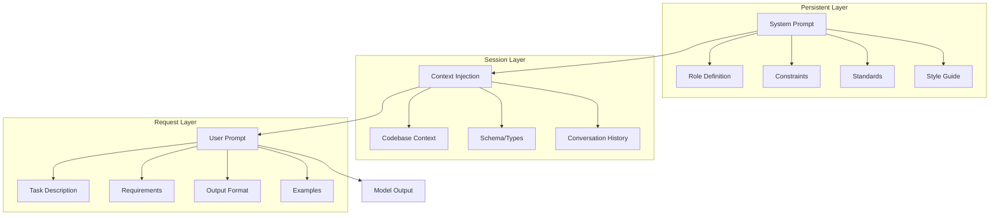
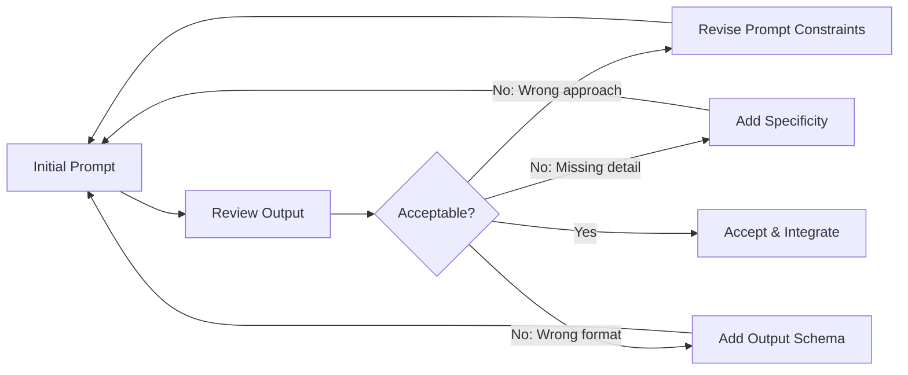

# Prompt Engineering for Software Development

> The craft of writing prompts that produce consistent, production-grade engineering output.

← [Frontend](./frontend.md) | [Back to Index](./README.md) | [DevOps →](./devops.md)

---

## Why Prompt Engineering Is Engineering

A prompt is a specification. Like any spec, it can be vague or precise, complete or missing edge cases, well-structured or a wall of text.

The difference between a developer who "uses AI" and one who "builds with AI" is the same difference between someone who writes tickets and someone who writes RFCs. Both describe work. One produces predictable outcomes.

### Quick Map (so you can skim fast)

- **System vs user prompting**: “System Prompt vs User Prompt Structure”
- **Roles**: “Role Prompting”
- **Reliability**: “Constraint Layering”
- **Making outputs machine-checkable**: “Structured Output Prompts”
- **Keeping prompts stable over time**: “Versioning Prompts”

---

## System Prompt vs User Prompt Structure

### Architecture of a Prompt System



### System Prompt: The Constitution

The system prompt defines **who the model is and what rules it follows.** It remains constant across interactions.

If you want the practical “where do I put this in my editor?” setup (Cursor rules, Copilot instructions, Windsurf rules, Continue config), see [AI Coding Tools](./tools.md) → “System Prompting (Persistent Instructions)”.

```
You are a senior backend engineer specializing in Python/FastAPI. You follow 
these rules without exception:

ARCHITECTURE:
- Clean architecture: routes → services → repositories
- Every endpoint has input validation via Pydantic
- Every mutation is wrapped in a database transaction
- All queries use parameterized statements

SECURITY:
- Authorization is checked per resource, not just per route
- Secrets come from environment variables only
- Error responses never contain stack traces or internal details
- Rate limiting is specified per endpoint tier

CODE STYLE:
- Type hints on all function signatures
- Docstrings on public functions
- No wildcard imports
- Maximum function length: 30 lines

OUTPUT FORMAT:
- When generating code, include the file path as a comment
- When modifying existing code, show only the changed functions
- Always include a brief explanation of design decisions
- Flag any security concerns you notice
```

### User Prompt: The Work Order

The user prompt is the **specific task** within the system's constraints.

```
Create the endpoint for user registration with these requirements:

INPUT: email, password, display_name
VALIDATION: email format, password min 10 chars, display_name 2-50 chars
BEHAVIOR:
- Check if email already exists (return 409 if so)
- Hash password with bcrypt
- Create user record
- Generate email verification token
- Dispatch verification email via background job
- Return user object (without password hash)

STATUS CODES: 201 (success), 409 (conflict), 422 (validation)

Include the test file.
```

---

## Role Prompting

### Why Roles Matter

Roles activate specific knowledge domains and writing patterns within the model. A "senior security engineer" prompt generates different code from a "junior developer" prompt — even for the same task.

### Role Templates

```
# For architecture decisions
You are a principal engineer conducting a technical design review. You have
15 years of experience shipping systems at scale. You are skeptical of 
over-engineering and biased toward simplicity until complexity is proven 
necessary.

# For security review
You are a senior application security engineer. Your specialization is 
OWASP Top 10 vulnerabilities in web APIs. You think adversarially — 
for every endpoint, your first instinct is "how would I exploit this?"

# For code review
You are a senior engineer performing a code review. You focus on:
correctness, security, performance, readability — in that order. You 
are direct. If code is wrong, say so. If it's fine, say so briefly.

# For debugging
You are a senior engineer debugging a production issue. You are 
methodical: gather facts, form hypotheses, test one at a time. You 
do not guess. You reason from evidence.

# For refactoring
You are a senior engineer refactoring legacy code. Your goal is to 
improve maintainability while preserving exact behavior. You make the 
smallest change that achieves the goal. You never refactor and add 
features in the same pass.
```

### Anti-Pattern: Role Stuffing

```
# BAD: Asking the model to be everything
You are a senior full-stack architect, security expert, UX designer, 
DevOps engineer, database administrator, and performance specialist...

# GOOD: One focused role per task
You are a senior database engineer specializing in PostgreSQL query
optimization.
```

**Rule:** One role per task. If you need multiple perspectives, run multiple prompts with different roles.

---

## Constraint Layering

The most powerful technique in prompt engineering is **constraint layering** — progressively narrowing the solution space until the only possible output is the correct one.

### Constraint Hierarchy

```
┌─────────────────────────────────────────┐
│  Layer 1: Technology Constraints         │
│  "Use Python 3.12, FastAPI, SQLAlchemy" │
├─────────────────────────────────────────┤
│  Layer 2: Architecture Constraints       │
│  "Clean architecture, async handlers"    │
├─────────────────────────────────────────┤
│  Layer 3: Security Constraints           │
│  "Parameterized queries, RBAC checks"   │
├─────────────────────────────────────────┤
│  Layer 4: Style Constraints              │
│  "Type hints, max 30 lines/function"    │
├─────────────────────────────────────────┤
│  Layer 5: Output Constraints             │
│  "Return JSON with file paths, tests"   │
└─────────────────────────────────────────┘
```

### Example: Layered Prompt

```
# Layer 1: Technology
Using FastAPI (0.109+) with SQLAlchemy 2.0 async, Pydantic v2, Python 3.12.

# Layer 2: Architecture  
Follow this structure:
- routes/ — endpoint definitions
- services/ — business logic
- repositories/ — database access
- schemas/ — Pydantic models

# Layer 3: Security
- All queries parameterized via SQLAlchemy ORM
- Endpoint authorization via dependency injection
- Input validated through Pydantic before reaching service layer
- Secrets from os.environ, never hardcoded

# Layer 4: Style
- Async functions with proper type hints
- Functions under 25 lines
- No comments explaining obvious code
- Error messages are user-facing (no internal details)

# Layer 5: Output
- Include file path as first-line comment
- Group related changes by file
- Include one test per endpoint (happy path + error case)
- Note any security considerations at the end

NOW: Implement the endpoint for updating a user's profile.
```

---

## Iterative Refinement Loops

Real-world prompting is almost never one-shot. It's a loop.

### The Refinement Process



### Refinement Patterns

**Pattern 1: Narrowing**
```
# Attempt 1 (too broad)
"Create a user service"
# Output: Generic CRUD with no auth, no validation, no error handling

# Attempt 2 (narrowed)
"Create a user service with:
- Input validation (Pydantic)
- Authorization checks (workspace-scoped)
- Error handling (custom AppError classes)
- Audit logging on mutations"
# Output: Better structure, but auth pattern is wrong

# Attempt 3 (precise)
"Create a user service following this existing auth pattern:
[paste existing auth middleware]
Ensure every public method checks workspace_id ownership against
the authenticated user's workspace. Reuse the AppError classes
from errors.py:
[paste error classes]"
# Output: Correct, consistent with existing codebase
```

**Pattern 2: Example-Driven Refinement**
```
# When the model's interpretation doesn't match yours:

"Here's an example of the code style I want:

```python
async def get_tasks(
    self,
    workspace_id: UUID,
    *,
    status: TaskStatus | None = None,
    limit: int = 20,
) -> list[Task]:
    stmt = (
        select(TaskModel)
        .where(TaskModel.workspace_id == workspace_id)
        .where(TaskModel.deleted_at.is_(None))
    )
    if status:
        stmt = stmt.where(TaskModel.status == status)
    stmt = stmt.limit(limit)
    result = await self.db.execute(stmt)
    return [Task.model_validate(row) for row in result.scalars()]
```

Now generate the equivalent for the Projects resource, following 
this exact pattern."
```

**Pattern 3: Diff Refinement**
```
"Your output is close but has these issues:
1. Line 23: Missing `await` on database call
2. Line 45: Authorization check should happen before data fetch
3. Line 67: Error message exposes internal table name — use generic message

Fix only these three issues. Do not change anything else."
```

---

## Output Schema Enforcement

### Structured Output Prompts

```
Respond ONLY with valid JSON matching this schema. Do not include 
markdown code fences, explanations, or any text outside the JSON.

SCHEMA:
{
  "endpoint": {
    "method": "string (GET|POST|PUT|PATCH|DELETE)",
    "path": "string",
    "description": "string"
  },
  "request": {
    "headers": [{"name": "string", "required": "boolean"}],
    "body": {"type": "object", "properties": {}} | null
  },
  "responses": [
    {
      "status": "integer",
      "description": "string",
      "body": {}
    }
  ],
  "authorization": {
    "required": "boolean",
    "scopes": ["string"]
  }
}

Generate the API spec for: user password reset flow
```

### Code Output Schema

```
For each file you generate, use this exact format:

--- FILE: [relative/path/to/file.ext] ---
[file content]
--- END FILE ---

Do not include any text between files.
Do not include explanation blocks.
If you need to explain a decision, use a code comment.
```

---

## Debugging Weak Outputs

### Diagnostic Framework

When the model produces bad output, diagnose the cause before re-prompting:

| Symptom | Likely Cause | Fix |
|---------|-------------|-----|
| Generic/boilerplate output | Prompt is too vague | Add specific constraints, examples, and context |
| Wrong library/pattern used | Context is missing or outdated | Inject code context from your actual codebase |
| Hallucinated API | Model doesn't know this specific library version | Provide the actual API signature or docs snippet |
| Inconsistent with existing code | No codebase context | Paste the existing pattern you want followed |
| Right structure, wrong details | Missing domain knowledge | Add business rules explicitly |
| Overly complex solution | No simplicity constraint | Add "Use the simplest approach that meets requirements" |
| Missing edge cases | No error/edge case specification | List specific edge cases to handle |

### The Debug Prompt

```
Your previous output has issues. I'll describe each one. Fix ONLY 
these issues. Do not restructure or refactor working code.

ISSUE 1: [describe what's wrong and what's expected]
ISSUE 2: [describe what's wrong and what's expected]

CONTEXT THAT MAY HELP:
[paste relevant code/docs the model may not know about]

Show me only the corrected sections, not the entire file.
```

---

## Versioning Prompts

### Why Version Prompts?

Prompts are code. They produce different outputs as models change. Version them like you version code.

### Prompt Version Structure

```yaml
# prompts/backend/create-endpoint.v3.yaml
name: create-endpoint
version: 3
model_tested: claude-3.5-sonnet-20241022
last_verified: 2026-02-01
description: Generate a full CRUD endpoint with auth, validation, and tests

system_prompt: |
  You are a senior backend engineer...

user_prompt_template: |
  Create a {method} endpoint for {resource} with:
  
  ENTITY: {entity_name}
  FIELDS: {fields}
  BUSINESS RULES: {rules}
  AUTH: {auth_requirements}

variables:
  - name: resource
    type: string
    example: "tasks"
  - name: fields
    type: list
    example:
      - "title: str, required, max 255"
      - "status: enum(todo,in_progress,done)"

changelog:
  v3: Added test generation, security constraint layer
  v2: Added auth requirements section
  v1: Initial version
```

### Prompt Library Structure

```
prompts/
├── system/
│   ├── backend-engineer.md        # Role: backend
│   ├── security-reviewer.md       # Role: security
│   ├── frontend-engineer.md       # Role: frontend
│   └── code-reviewer.md           # Role: review
├── backend/
│   ├── create-endpoint.md
│   ├── database-migration.md
│   ├── auth-flow.md
│   └── performance-audit.md
├── frontend/
│   ├── create-component.md
│   ├── state-management.md
│   ├── accessibility-audit.md
│   └── performance-audit.md
├── devops/
│   ├── dockerfile.md
│   ├── ci-pipeline.md
│   ├── monitoring-setup.md
│   └── iac-module.md
├── review/
│   ├── code-review.md
│   ├── security-review.md
│   └── architecture-review.md
└── meta/
    ├── debug-output.md            # Fixing bad model output
    └── refine-prompt.md           # Improving existing prompts
```

---

## Prompt Composition Patterns

### Chaining Prompts

For complex tasks, decompose into sequential prompts where each output becomes the next input:

```
PROMPT 1: "Given these requirements, generate the database schema"
         → Output: SQL DDL

PROMPT 2: "Given this schema, generate the Pydantic models"
         → Input: SQL DDL from Prompt 1
         → Output: Python models

PROMPT 3: "Given these models, generate the repository layer"
         → Input: Pydantic models from Prompt 2
         → Output: SQLAlchemy queries

PROMPT 4: "Given this repository, generate the service layer with 
           business rules: [rules]"
         → Input: Repository from Prompt 3
         → Output: Service methods

PROMPT 5: "Given this service, generate the FastAPI routes with auth"
         → Input: Service from Prompt 4
         → Output: Route handlers
```

### Parallel Prompts

For independent components, run prompts simultaneously:

```
PARALLEL:
  PROMPT A: "Generate the frontend TaskCard component" 
  PROMPT B: "Generate the backend task validation schemas"
  PROMPT C: "Generate the database migration for tasks"
  
THEN:
  PROMPT D: "Integrate these three outputs. Verify the types match
             across frontend → API → database. Flag any mismatches."
```

### Meta-Prompts

Use the model to improve its own prompts:

```
I have this prompt that produces inconsistent results:

[paste your current prompt]

The output quality varies in these ways:
1. Sometimes includes error handling, sometimes doesn't
2. Test coverage is inconsistent
3. Code style varies between outputs

Rewrite this prompt to produce more consistent results. 
Add explicit constraints for each inconsistency I described.
Explain why each change improves consistency.
```

---

## Advanced Techniques

### Context Window Management

```
┌──────────────────────────────────────────────────────┐
│                    Context Window                     │
├──────────────────────────────────────────────────────┤
│  System Prompt (fixed)                    ~500 tokens │
│  ┌────────────────────────────────────────────────┐  │
│  │  Project Context (injected)        ~2000 tokens│  │
│  │  - Architecture overview                       │  │
│  │  - Relevant schema definitions                 │  │
│  │  - Existing patterns to follow                 │  │
│  └────────────────────────────────────────────────┘  │
│  ┌────────────────────────────────────────────────┐  │
│  │  Task Context (current file)       ~1000 tokens│  │
│  │  - File being modified                         │  │
│  │  - Related files                               │  │
│  └────────────────────────────────────────────────┘  │
│  ┌────────────────────────────────────────────────┐  │
│  │  User Prompt (task)                 ~500 tokens│  │
│  └────────────────────────────────────────────────┘  │
│  ┌────────────────────────────────────────────────┐  │
│  │  RESERVED FOR OUTPUT              ~4000 tokens │  │
│  └────────────────────────────────────────────────┘  │
└──────────────────────────────────────────────────────┘

RULES:
1. Put the most volatile context closest to the user prompt
2. Put the most stable context in the system prompt
3. If context doesn't fit, summarize — don't truncate mid-file
4. Always leave 40%+ of window for output
```

### Few-Shot Prompting for Code

```
Generate a repository method following this pattern.

EXAMPLE INPUT:
"List users by workspace with pagination"

EXAMPLE OUTPUT:
```python
async def list_by_workspace(
    self,
    workspace_id: UUID,
    *,
    cursor: UUID | None = None,
    limit: int = 20,
) -> tuple[list[User], UUID | None]:
    stmt = (
        select(UserModel)
        .where(UserModel.workspace_id == workspace_id)
        .where(UserModel.deleted_at.is_(None))
        .order_by(UserModel.created_at.desc())
        .limit(limit + 1)
    )
    if cursor:
        cursor_record = await self.db.get(UserModel, cursor)
        if cursor_record:
            stmt = stmt.where(
                UserModel.created_at < cursor_record.created_at
            )
    
    result = await self.db.execute(stmt)
    rows = list(result.scalars())
    
    next_cursor = rows[-1].id if len(rows) > limit else None
    return rows[:limit], next_cursor
```

NOW GENERATE:
"List tasks by project with status filter and pagination"
```

---

## Common Failure Modes

| Failure | Symptom | Root Cause |
|---------|---------|------------|
| **Prompt rot** | Same prompt produces worse results after model update | Prompts relied on model-specific behavior. Add explicit examples |
| **Context overflow** | Model ignores constraints at the end of long prompts | Important constraints buried. Move critical rules to system prompt |
| **Specification gaps** | Model fills gaps with assumptions you didn't want | Every decision point needs explicit guidance or the model will guess |
| **Example overfitting** | Model copies example too literally (wrong variable names, etc.) | Clarify that examples show *pattern*, not *content* |
| **Role confusion** | Output mixes concerns (code + essay + opinions) | Role and output format not constrained. Separate them explicitly |
| **Hallucinated APIs** | Model invents function signatures | Inject actual library docs or API signatures into context |
| **Inconsistent formatting** | Output format varies between runs | Enforce format with schema or explicit delimiters |
| **Lost context mid-conversation** | Model forgets earlier constraints | Repeat critical constraints. Models have recency bias |

---

## Production Checklist

- [ ] System prompts versioned in source control
- [ ] Prompt templates use explicit placeholders, not natural language gaps
- [ ] Critical constraints appear in system prompt (not just user prompt)
- [ ] Output format is enforced with schema or explicit delimiters
- [ ] Prompts include relevant codebase context (not just the task)
- [ ] Complex tasks are decomposed into chained prompts
- [ ] Prompt library is organized by domain and indexed
- [ ] Each prompt template documents which model it was tested against
- [ ] Prompts include negative constraints ("Do NOT do X")
- [ ] Few-shot examples exist for pattern-sensitive tasks
- [ ] Meta-prompts used periodically to improve prompt quality
- [ ] Output is always reviewed — never committed without human inspection

---

← [Frontend](./frontend.md) | [Back to Index](./README.md) | [DevOps →](./devops.md)
