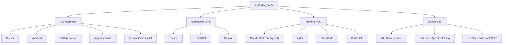
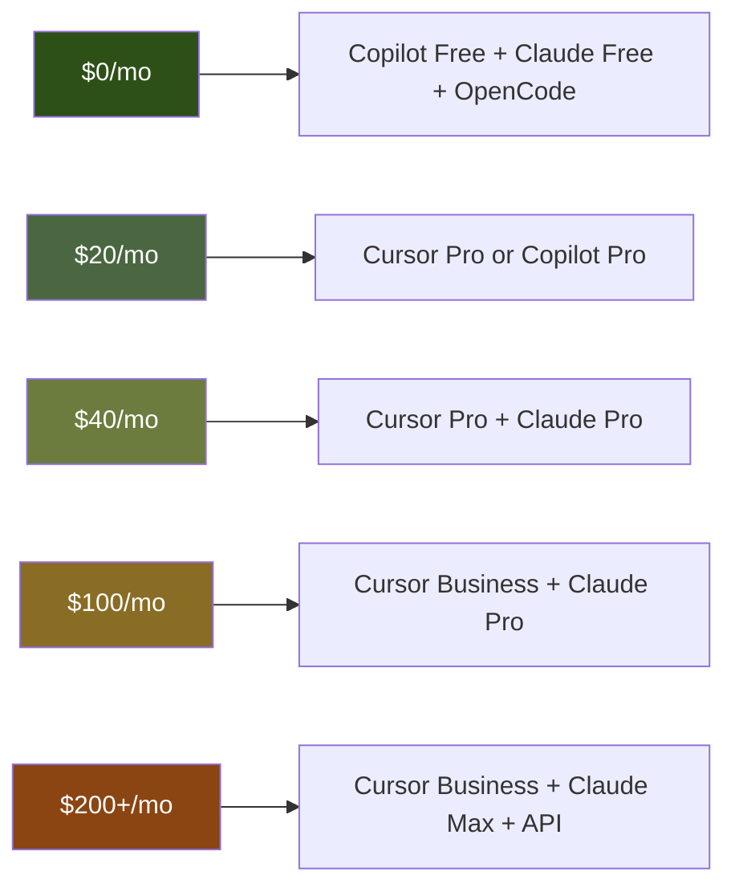

# AI Coding Tools

> The right tool at the right price doesn't just save money — it changes what's possible to build alone.

← [Application Security](./security.md) | [Workflows](./workflows.md) →

---

## Why This Chapter Exists

Every tool in this guide serves one function: **turning prompts into production code faster**. The market moves monthly — new tools launch, pricing changes, features merge. This chapter is a snapshot of what exists, what it costs, and how to choose based on your situation.

This is not a ranking. Every tool here has legitimate use cases. The best tool is the one that fits your workflow, your budget, and your project constraints.

---

## Tool Categories

Before comparing specific products, understand what you're choosing between:



### Categories Explained

| Category | Best For | Trade-off |
|----------|----------|-----------|
| **IDE-Integrated** | Daily coding, refactoring, autocomplete, in-context edits | Locked to one editor, subscription models |
| **Standalone Chat** | Architecture design, debugging, research, complex reasoning | Copy-paste workflow, no direct file access |
| **Terminal / CLI** | Multi-file edits, automation, codebase-wide changes, scripting | Steeper learning curve, text-only interface |
| **Specialized** | Rapid prototyping, UI generation, MVPs | Limited customization, vendor lock-in |

---

## Budget Tiers

### Tier 1: Free / $0

For students, hobbyists, open-source contributors, or anyone evaluating before committing.

| Tool | What You Get | Limitations |
|------|-------------|-------------|
| **GitHub Copilot Free** | Autocomplete in VS Code, 2000 completions/month, 50 chat messages/month | Limited model choice, low usage cap |
| **Gemini Code Assist (Free)** | Code completion + chat in VS Code / JetBrains, powered by Gemini | Usage limits, no advanced features |
| **Claude Free** | Web chat with Claude 3.5 Sonnet, limited usage | No file access, rate limited, no API |
| **ChatGPT Free** | GPT-4o-mini, limited GPT-4o | No file access, rate limited |
| **Gemini Free** | Web chat with Gemini 2.0 Flash, Google integration | Rate limited, no API access |
| **Aider (with free models)** | Terminal-based pair programming, supports free-tier API keys | Requires own API key, setup required |
| **OpenCode** | Open-source terminal TUI agent, multi-model, LSP integration, session persistence | Requires own API key, newer ecosystem |
| **Cody (Free)** | Sourcegraph's autocomplete + chat in VS Code | Usage limits |
| **Continue.dev** | Open-source IDE extension, bring your own model/API key | Requires configuration, BYOK |

#### Best Free Stack

```
PRIMARY:      Gemini Code Assist (IDE autocomplete + chat)
SECONDARY:    Claude Free (complex reasoning, architecture)
FALLBACK:     ChatGPT Free (general questions)
TERMINAL:     Aider or OpenCode + free API tier
```

**What you sacrifice:** Usage caps force context-switching between tools. No advanced agentic features. Limited model selection.

---

### Tier 2: $10–25/month

The sweet spot for independent developers and freelancers. This is where prompting becomes a genuine productivity multiplier.

| Tool | Price | What You Get |
|------|-------|-------------|
| **GitHub Copilot Pro** | $10/mo | Unlimited completions, chat, multi-model (GPT-4o, Claude 3.5 Sonnet, Gemini), agentic mode |
| **Claude Pro** | $20/mo | Extended Claude 3.5 Sonnet / Opus usage, Projects, priority access |
| **ChatGPT Plus** | $20/mo | GPT-4o, GPT-4o-mini, DALL-E, Code Interpreter, browsing |
| **Gemini Advanced** | $20/mo | Gemini 2.0 Pro, 1M token context, Google ecosystem integration |
| **Cursor Pro** | $20/mo | 500 fast premium requests/month, unlimited slow requests, multi-model |
| **Windsurf Pro** | $15/mo | Cascade AI agent, multi-file edits, command execution |
| **Augment Code** | $20/mo | Deep codebase understanding, multi-repo context |

#### Best Mid-Range Stack

```
PRIMARY:      Cursor Pro ($20) — daily coding, in-editor agent
              OR
              GitHub Copilot Pro ($10) — if you want model variety + lower cost
REASONING:    Claude Pro ($20) — architecture, complex debugging, long context
TOTAL:        $30-40/month
```

**Why Claude Pro alongside an IDE tool?** IDE tools excel at implementation — autocomplete, refactoring, in-file edits. But for the *thinking* parts of prompt-driven development — system design, threat modeling, debugging complex logic — a dedicated reasoning model with long context is irreplaceable. They serve different parts of the workflow.

---

### Tier 3: $50–100/month

For professional developers, small teams, and serious builders who treat AI as core infrastructure.

| Tool | Price | What You Get |
|------|-------|-------------|
| **Cursor Business** | $40/mo | Unlimited fast requests, admin controls, team features |
| **Claude Max (5×)** | $100/mo | 5× Pro usage of all models, extended thinking, priority |
| **GitHub Copilot Business** | $19/mo/user | Organization controls, IP indemnity, policy management |
| **Gemini Code Assist Enterprise** | $45/mo/user | Code customization, full codebase context, enterprise security |
| **Augment Code Teams** | $30/mo/user | Team-wide codebase understanding, shared context |
| **Windsurf Teams** | $30/mo/user | Shared workspaces, admin controls |

#### Best Professional Stack

```
IDE:          Cursor Business ($40) — unlimited fast model access
REASONING:    Claude Max ($100) — heavy architecture + security review
API:          Anthropic API / OpenAI API (pay-as-you-go for automation)
TOTAL:        $140-180/month + API costs
```

**When this pays for itself:** If you bill $100+/hour and AI saves you 2 hours/week, the entire stack pays for itself in the first week of each month.

---

### Tier 4: $200+/month (API-Heavy / Team)

For teams, startups building AI-powered products, or developers running automated pipelines.

| Tool | Price | What You Get |
|------|-------|-------------|
| **Claude Max (20×)** | $200/mo | 20× Pro usage, maximum model access |
| **Anthropic API** | Pay-per-token | Claude 3.5 Sonnet, Claude 3 Opus, batch API, function calling |
| **OpenAI API** | Pay-per-token | GPT-4o, o1, embeddings, fine-tuning, assistants |
| **Google AI API** | Pay-per-token | Gemini 2.0 Pro/Flash, Vertex AI, grounding |
| **Cursor Enterprise** | Custom | SSO, audit logs, custom deployment, compliance |

#### API Cost Examples

| Task | Model | Approximate Cost |
|------|-------|-----------------|
| Generate 100 API endpoints | Claude 3.5 Sonnet | ~$2-5 |
| Review 50 files for security | GPT-4o | ~$3-8 |
| Generate test suite for full app | Claude 3.5 Sonnet | ~$1-3 |
| Daily coding assistant (8 hrs) | Gemini 2.0 Flash | ~$0.50-2 |
| Fine-tune on your codebase | GPT-4o-mini fine-tuning | ~$10-50 one-time |

---

## Tool Deep Dives

### Cursor

**What it is:** A fork of VS Code with AI deeply integrated into the editor experience.

**Strengths:**
- Composer mode: describe what you want, it edits multiple files
- Tab completion: context-aware autocomplete that understands your patterns
- Inline diff: shows proposed changes before applying
- Multi-model: switch between Claude, GPT-4o, Gemini per request
- `.cursorrules`: project-level AI configuration file

**Weaknesses:**
- Fork of VS Code — updates lag behind official VS Code
- 500 fast requests/month on Pro can run out mid-project
- Agent mode still maturing (occasionally hallucinates file paths)

**Best for:** Daily coding workflow, rapid prototyping, developers who live in their editor.

**Pro tip — `.cursorrules` file:**

```
You are an expert in Python, FastAPI, PostgreSQL, and React.

Key principles:
- Use type hints everywhere
- All database queries use SQLAlchemy ORM
- Return Pydantic models from all endpoints
- Follow the existing project structure in /src
- Write pytest tests for every new function
- Use async/await for all I/O operations
```

---

### Claude (Anthropic)

**What it is:** Anthropic's AI assistant, available via web, API, and integrated into various tools.

**Strengths:**
- Long context window (200K tokens) — can ingest entire codebases
- Projects feature: persistent context across conversations
- Artifacts: generates standalone code, documents, diagrams
- Strong at architectural reasoning and security analysis
- Honest about uncertainty — less likely to hallucinate confidently

**Weaknesses:**
- Web interface requires copy-paste workflow for code
- No direct file system access in web version
- Rate limits on Pro can be restrictive during heavy usage

**Best for:** Architecture design, security reviews, complex debugging, documentation, code review.

---

### Gemini Antigravity (Google DeepMind)

**What it is:** Google's agentic AI coding system, integrated into the IDE as a full development partner.

**Strengths:**
- Deep agentic capabilities — executes commands, edits files, runs tests
- Browser control — can interact with web applications for testing
- Multi-step task execution — handles complex workflows autonomously
- Knowledge system — learns from past conversations and project context
- Integrated terminal — runs commands directly in the development environment

**Weaknesses:**
- Newer ecosystem — still evolving
- Requires specific IDE setup

**Best for:** Complex multi-file refactoring, full-stack development, agentic workflows where the AI needs to execute and verify.

---

### GitHub Copilot

**What it is:** GitHub's AI pair programmer, the most widely adopted coding assistant.

**Strengths:**
- Deepest VS Code integration (native, not a fork)
- Multi-model: GPT-4o, Claude 3.5 Sonnet, Gemini (your choice)
- Copilot Chat: inline explanations and refactoring
- Agentic mode: multi-file edits with planning
- Copilot Workspace: issue-to-PR automation
- $10/mo Pro tier — best value entry point

**Weaknesses:**
- Autocomplete can be overly aggressive
- Context window smaller than Claude-based tools
- Enterprise features require GitHub ecosystem buy-in

**Best for:** Developers already on GitHub who want solid autocomplete + chat without switching editors. Best value at $10/month.

---

### Windsurf (Codeium)

**What it is:** An AI-native IDE (VS Code fork) with the Cascade agent for multi-step coding tasks.

**Strengths:**
- Cascade: agentic flow that plans, edits, and runs commands
- Supercomplete: predicts your next edit based on recent changes
- $15/mo Pro — lower entry point than Cursor
- Built-in terminal integration for command execution

**Weaknesses:**
- Smaller ecosystem than Cursor or Copilot
- Model selection more limited
- Cascade can over-engineer simple tasks

**Best for:** Developers who want agentic coding at a lower price point than Cursor.

---

### Aider

**What it is:** Open-source terminal-based AI pair programming tool.

**Strengths:**
- Free and open source — bring your own API key
- Git-native: every AI edit is a git commit
- Works with any model (Claude, GPT-4o, Gemini, local models)
- Architect mode: uses a strong model for planning, weak model for coding
- Universal: works in any terminal, any project, any language

**Weaknesses:**
- Terminal-only — no GUI, no visual diff
- Requires API key management
- Learning curve for effective use
- Cost depends entirely on API usage

**Best for:** Developers who prefer terminal workflows, open-source contributors, budget-conscious builders using cheap API models.

---

### OpenCode

**What it is:** An open-source, Go-based terminal AI coding agent with a rich TUI (Terminal User Interface) built on Bubble Tea.

**Strengths:**
- Beautiful interactive TUI — not just a REPL, a full terminal application with panels and split views
- Multi-provider: OpenAI, Anthropic, Google, Groq, AWS Bedrock, Azure, OpenRouter, local models
- LSP integration: real code intelligence (go-to-definition, diagnostics) fed to the AI
- Session persistence: SQLite-backed conversation history, resume where you left off
- Git-aware: understands repo history and diffs for contextual edits
- File change tracking: visualizes modifications during sessions
- Vim-like editor: familiar keybindings for terminal-native developers
- Desktop app (beta): GUI companion across macOS, Windows, Linux

**Weaknesses:**
- Newer than Aider — smaller community and fewer battle-tested workflows
- Requires API key setup and configuration
- TUI paradigm has a learning curve for non-terminal users

**Best for:** Developers who want an Aider-like terminal experience but with a richer UI, LSP-powered intelligence, and session management. Especially strong for Go, Rust, and Python projects where LSP support shines.

**OpenCode vs Aider:**

| Aspect | OpenCode | Aider |
|--------|----------|-------|
| Interface | Rich TUI with panels, Vim editor | Simple REPL |
| Git integration | Aware of history, diffs | Native — every edit is a commit |
| Code intelligence | LSP integration | File-based context |
| Session management | SQLite persistence, resume | Conversation-based |
| Maturity | Newer, rapidly evolving | Established, large community |
| Language | Go | Python |
| Desktop option | Beta available | Terminal only |

---

### Specialized Tools

| Tool | What It Does | Price | Best For |
|------|-------------|-------|----------|
| **v0** (Vercel) | Generates React + Tailwind UI from prompts | Free tier + Pro $20/mo | Frontend prototyping, UI generation |
| **bolt.new** (StackBlitz) | Full-stack app scaffolding in browser | Free tier + Pro $20/mo | Rapid MVPs, proof of concepts |
| **Lovable** | Generates full-stack applications from descriptions | Free tier + Pro $20/mo | Non-technical founders, rapid prototyping |
| **Replit Agent** | Builds and deploys apps in Replit environment | $25/mo (Replit Core) | Quick deployments, learning |

**When to use specialized tools:** When you need a working prototype in under 30 minutes and plan to rebuild it properly afterward. Never ship specialized tool output directly to production.

---

## Decision Matrix

### By Role

| Role | Primary Tool | Secondary | Budget |
|------|-------------|-----------|--------|
| **Student** | GitHub Copilot Free + Claude Free | Aider (free APIs) | $0 |
| **Hobbyist** | Cursor Pro or Copilot Pro | Claude Free | $10-20/mo |
| **Freelancer** | Cursor Pro + Claude Pro | v0 for UI prototypes | $40/mo |
| **Startup Developer** | Cursor Business + Claude Max | API access for automation | $140+/mo |
| **Team Lead** | GitHub Copilot Business + Gemini Enterprise | Claude API for reviews | $60+/mo/user |

### By Project Type

| Project | Best Tool | Why |
|---------|-----------|-----|
| **Quick script / utility** | Aider, OpenCode, or Copilot | Fast, low overhead |
| **Full-stack web app** | Cursor + Claude | Cursor for code, Claude for architecture |
| **API-heavy backend** | Cursor + Claude Pro | Strong at schema design and security |
| **Mobile app (Flutter)** | Cursor + Gemini | Gemini has strong Dart/Flutter knowledge |
| **Infrastructure / DevOps** | Aider / OpenCode + Claude | Terminal workflow fits IaC naturally |
| **Security audit** | Claude Pro/Max | Long context for full codebase review |
| **UI prototype** | v0 + Cursor | v0 generates, Cursor refines |
| **Legacy codebase** | Augment Code | Deep codebase understanding |

### By Budget



---

## The Prompt-Tool Integration Pattern

Different tools excel at different stages of the prompting workflow:

| Workflow Stage | Best Tool Type | Example |
|----------------|---------------|---------|
| **1. Requirements** | Standalone Chat | Claude — long reasoning about scope |
| **2. Architecture** | Standalone Chat | Claude — system design with diagrams |
| **3. Project Setup** | Terminal / CLI | Aider, OpenCode, or Antigravity — scaffold structure |
| **4. Implementation** | IDE-Integrated | Cursor / Copilot — write feature code |
| **5. Testing** | IDE-Integrated | Cursor — generate tests inline |
| **6. Security Review** | Standalone Chat | Claude — full codebase audit |
| **7. DevOps** | Terminal / CLI | Aider — Dockerfiles, CI/CD pipelines |
| **8. Debugging** | IDE-Integrated | Cursor — inline error resolution |
| **9. Documentation** | Standalone Chat | Claude — generate docs from code |
| **10. Code Review** | Standalone Chat | Claude / Gemini — review PRs |

### Multi-Tool Workflow Example

```
STEP 1 — ARCHITECTURE (Claude Pro)
"Design a workspace-based SaaS for invoice management..."
→ Get system diagram, API contracts, database schema

STEP 2 — SCAFFOLD (Terminal — Aider or Antigravity)
"Create the project structure per this architecture..."
→ Directories, configs, base files created

STEP 3 — IMPLEMENT (Cursor Pro)
"Implement the invoice CRUD endpoints per this contract..."
→ Daily coding in the editor with autocomplete

STEP 4 — SECURITY (Claude Pro)
"Audit this codebase for OWASP Top 10 vulnerabilities..."
→ Full security review with specific fix recommendations

STEP 5 — DEPLOY (Terminal — Aider or OpenCode)
"Generate Dockerfile, docker-compose, and GitHub Actions CI/CD..."
→ Infrastructure as code
```

---

## Understanding the Models

Behind every coding tool is a language model. The tool is the steering wheel — the model is the engine. Picking the wrong model for the task is like towing a trailer with a sports car or racing a dump truck. This section breaks down every model you'll encounter in coding tools, what it's actually good at, where it fails, and when to use it.

### How to Read This Section

Each model gets three things:

1. **What it actually does well** — not marketing claims, but observed behavior in real coding workflows
2. **Where it breaks** — the failure modes you'll hit in production use
3. **When to reach for it** — the specific tasks where this model outperforms alternatives

Benchmark scores are included where useful, but treat them as directional signals, not gospel. A model scoring 90% on HumanEval (isolated function generation) may struggle with a 50-file refactor. Real-world coding is messier than benchmarks.

---

### Proprietary Models

---

#### Claude Sonnet 4 / 3.7 Sonnet (Anthropic)

**The architect's model.** Claude Sonnet is the model most developers reach for when the task requires *thinking* — not just code generation, but understanding why code should be structured a certain way.

**Architecture:** Dense transformer, 200K token context window. Extended thinking mode available for complex reasoning chains.

**What it does well:**
- **Multi-file reasoning.** Can hold an entire codebase in context and understand relationships between modules. If you paste 15 files and ask "where's the auth bug," it finds it.
- **Security awareness.** Trained with strong safety orientation that transfers to code — it naturally considers injection vectors, access control gaps, and data exposure.
- **Persistent debugging.** Will iteratively rewrite and test code rather than giving up after one attempt. Keeps refining until the logic is correct.
- **Honest uncertainty.** When it doesn't know something, it says so. This is more valuable than you think — a model that confidently hallucinates a wrong approach costs you hours.
- **Instruction following.** Excels at complex, multi-constraint prompts. "Build X using Y framework, with Z pattern, securing against A, B, C" — it tracks all constraints simultaneously.
- **Large refactors.** Can restructure entire codebases while maintaining consistency across files.

**Where it breaks:**
- **Speed.** ~23 tokens/second in some configurations. Slower than GPT-4o for rapid-fire questions.
- **Mathematical reasoning.** Scores lower than GPT-4o on pure math benchmarks. If your code is algorithm-heavy with complex mathematical proofs, consider alternatives.
- **Long conversation drift.** After very long conversations (50+ exchanges), coherence can degrade. Start fresh conversations for new tasks.
- **Rate limits.** Even on Pro plans, heavy usage hits rate limits during intense coding sessions.

**Benchmarks:** SWE-bench Verified ~70-77%, HumanEval ~86-92%

**When to use it:**
- Architecture design and system planning
- Security audits and threat modeling
- Complex debugging across multiple files
- Code review with nuanced feedback
- Refactoring large codebases
- Writing technical documentation

---

#### Claude Opus 4 (Anthropic)

**The deep thinker.** Opus is Claude's most powerful model — slower and more expensive, but capable of reasoning that other models simply cannot replicate.

**Architecture:** Dense transformer, 200K token context window. Highest-capacity model in the Claude family.

**What it does well:**
- **Multi-step reasoning chains.** Can hold 10+ logical dependencies in working memory simultaneously. Excels at problems that require "if A then B, but if B and C then not D" reasoning.
- **Nuanced analysis.** Doesn't just find bugs — explains the second and third-order consequences of the bug.
- **Complex system design.** Can reason about distributed systems, consistency models, and failure modes that simpler models miss.
- **Research-grade problems.** When the problem is genuinely hard — novel algorithms, complex data structures, unusual architectures — Opus outperforms.

**Where it breaks:**
- **Cost.** Significantly more expensive per token than Sonnet. For routine coding, this is wasted money.
- **Speed.** Slower than every other Claude model. Not suitable for real-time autocomplete or quick questions.
- **Overkill for simple tasks.** Using Opus to write a CRUD endpoint is like hiring a PhD to sort mail.

**Benchmarks:** SWE-bench Verified ~79-81%

**When to use it:**
- Debugging problems that have stumped you for hours
- Designing novel architectures without existing patterns
- Security analysis of complex authorization flows
- Performance optimization of critical paths
- Problems where "good enough" isn't acceptable

---

#### GPT-4o (OpenAI)

**The generalist.** GPT-4o is the Swiss Army knife — it does everything reasonably well, nothing extraordinarily. Its strength is breadth, not depth.

**Architecture:** Dense transformer, 128K token context. Native multimodal (text, image, audio). ~109 tokens/second processing speed.

**What it does well:**
- **Speed.** Fastest of the premium models. For rapid-fire coding questions, it feels instant.
- **Multimodal input.** Can read screenshots of error messages, UI mockups, and architecture diagrams. Paste a screenshot of a bug, get a fix.
- **Broad language coverage.** Performs well across nearly every programming language, including obscure ones. Strong with non-English languages too.
- **Creative problem-solving.** Good at generating novel approaches to problems. If you're brainstorming solutions, GPT-4o often suggests angles you haven't considered.
- **Ecosystem integration.** Available in more tools than any other model — Copilot, Cursor, every API wrapper. The most "plug-and-play" model.

**Where it breaks:**
- **Deep reasoning.** On problems requiring 10+ logical steps, GPT-4o drops threads. It starts strong but loses coherence on highly complex reasoning chains.
- **Instruction nuance.** Tends to oversimplify complex constraints. If your prompt has 8 requirements, it might nail 6 and subtly miss 2.
- **Hallucination confidence.** When it's wrong, it's confidently wrong. It won't tell you "I'm not sure about this" — it'll generate plausible-looking code that's subtly broken.
- **Security awareness.** Doesn't instinctively consider security implications unless explicitly prompted. Will generate code with SQL injection vulnerabilities if you don't specify parameterized queries.
- **Large context degradation.** Despite the 128K window, quality drops significantly past ~60K tokens. The model "forgets" earlier context.

**Benchmarks:** HumanEval ~90%, SWE-bench Verified ~55-65%

**When to use it:**
- Quick coding questions and explanations
- Rapid prototyping where speed matters more than perfection
- Multimodal tasks (interpreting screenshots, diagrams)
- Working in less-common programming languages
- Brainstorming approaches before implementing

---

#### GPT-4o-mini (OpenAI)

**The workhorse.** Fast, cheap, and good enough for most routine coding tasks. This is the model that powers autocomplete engines.

**Architecture:** Smaller, faster variant of GPT-4o. Designed for high-throughput, low-latency use cases.

**What it does well:**
- **Cost efficiency.** 10-20× cheaper than GPT-4o per token. For high-volume tasks (autocomplete, generating tests, boilerplate), the cost difference is massive.
- **Speed.** Sub-second response times for short completions. Feels invisible as an autocomplete engine.
- **Simple code generation.** CRUD operations, utility functions, data transformations — it handles these flawlessly.
- **Format compliance.** Reliably produces structured output (JSON, YAML, configs) without formatting errors.

**Where it breaks:**
- **Complex logic.** Anything requiring multi-step reasoning or understanding of broader system context.
- **Novel problems.** If the pattern doesn't exist in its training data, it struggles. Weak at creative problem-solving.
- **Security.** Will generate insecure code by default. Not suitable for tasks where security matters.
- **Large codebases.** Cannot reason across multiple files or understand system-wide architecture.

**When to use it:**
- Autocomplete in IDEs
- Generating boilerplate and repetitive code
- Simple unit test generation
- Data format conversions
- Any task where speed and cost matter more than depth

---

#### o3 / o4-mini (OpenAI)

**The reasoners.** These are OpenAI's chain-of-thought models — they "think" through problems step by step before answering. Fundamentally different from GPT-4o.

**Architecture:** Built on extended reasoning — the model generates internal reasoning traces before producing output. Slower but more accurate on problems requiring logic.

**o3 — What it does well:**
- **Algorithmic problems.** Excels at competitive programming-style challenges. Codeforces Elo of 2727 — expert-level competitive programmer.
- **Mathematical reasoning.** Can work through proofs, derivations, and math-heavy algorithms that other models get wrong.
- **Debugging logic errors.** When the bug is in the *logic* (not a typo or API misuse), o3 methodically traces through the code to find it.
- **Step-by-step problem decomposition.** Breaks complex problems into sub-problems and solves each one before combining.

**o4-mini — What it does well:**
- **Fast reasoning.** Delivers most of o3's reasoning capability at a fraction of the cost and latency.
- **Cost-efficient logic.** When you need reasoning but can't justify o3's cost for every request.
- **Coding + math combo.** Particularly strong when the code involves mathematical transformations.

**Where they break:**
- **Speed.** o3 is *slow*. The reasoning traces add significant latency — 10-30 seconds per response is common.
- **Overkill for simple code.** If you're writing a REST endpoint, o3 will "think" about it like it's a competitive programming problem. Wasteful.
- **Context handling.** Not designed for large codebase analysis. Better at focused, self-contained problems.
- **Cost.** o3 is expensive per query. Not practical for routine coding.

**Benchmarks:** o3: SWE-bench 72-81%, Codeforces 2727 Elo. o4-mini: SWE-bench ~69%

**When to use them:**
- Algorithm design and optimization
- Mathematical or scientific computing
- Complex state machine logic
- Performance-critical code where correctness is paramount
- Competitive programming challenges
- Debugging logic errors that other models miss

---

#### Gemini 2.5 Pro (Google)

**The context monster.** Gemini 2.5 Pro's defining feature is its massive context window — up to 1 million tokens, with experimental 2M support. No other commercial model comes close for whole-codebase reasoning.

**Architecture:** Multimodal transformer with massive context. Native support for text, code, images, audio, and video. Deep Think mode for enhanced reasoning.

**What it does well:**
- **Massive codebase analysis.** Can literally ingest an entire repository (1M tokens ≈ ~30,000 lines of code with context) and reason about it. No chunking, no RAG, no summarization — the whole codebase in one prompt.
- **Full-stack web development.** Topped the WebDev Arena leaderboard. Particularly strong at generating complete, working web applications.
- **Code execution.** Has a built-in Python interpreter for direct code execution, debugging, and prototyping within the conversation.
- **Multimodal coding.** Can read UI mockups, architecture diagrams, and error screenshots to generate corresponding code.
- **Documentation mining.** Excels at reading large documentation sets and generating code that correctly uses the APIs described.

**Where it breaks:**
- **"Silly mistakes."** Despite impressive benchmark numbers, real-world users report more trivial errors (typos, off-by-one, wrong API names) than Claude or GPT-4o.
- **Instruction precision.** Can miss nuanced requirements in complex prompts. More literal-minded than Claude.
- **Ecosystem lock-in.** Deepest integration is with Google Cloud. Less available in third-party tools than GPT or Claude models.
- **Consistency.** Output quality varies more run-to-run than Claude Sonnet. The same prompt can produce noticeably different quality code.

**Benchmarks:** HumanEval ~99% (code pass), SWE-bench Verified ~65-77%

**When to use it:**
- Analyzing or refactoring large codebases (10K+ lines in context)
- Full-stack web application generation
- Code migration projects (understanding the source codebase fully)
- Documentation-to-code conversion
- Projects requiring multimodal input (mockups → code)

---

#### Gemini 2.0 Flash (Google)

**The speed demon.** Built for high-throughput, low-latency scenarios. Think of it as Google's answer to GPT-4o-mini, but with multimodal capabilities.

**Architecture:** Lightweight, fast variant of the Gemini architecture. Designed for edge cases, rapid prototyping, and RAG applications.

**What it does well:**
- **Speed.** Among the fastest models available. Response times rival GPT-4o-mini.
- **Cost efficiency.** Significantly cheaper than Gemini Pro. Suitable for high-volume automated tasks.
- **RAG applications.** Performs well as a synthesis layer over retrieved documents. Great for chatbots that answer questions about your codebase.
- **Quick prototyping.** Generates functional code rapidly for early-stage exploration.

**Where it breaks:**
- **Depth.** Shallow reasoning on complex problems. Not suitable for architecture design or security review.
- **Error rate.** More frequent trivial errors than premium models. Requires more review.
- **Context window.** Smaller than Gemini Pro. Not for large codebase analysis.

**When to use it:**
- IDE autocomplete engines
- Automated code documentation
- CI/CD pipeline integration (automated PR descriptions, test generation)
- High-volume, cost-sensitive tasks
- RAG-based code search and Q&A

---

#### Grok 3 (xAI)

**The newcomer.** xAI's entry into the coding LLM space. Strong on benchmarks, with a unique integration through the X (Twitter) ecosystem and Grok Studio for in-browser coding.

**Architecture:** Dense transformer. "Big Brain" mode adds extended reasoning time for complex problems. Available via X and API.

**What it does well:**
- **Competitive coding.** 79.4% on LiveCodeBench, which exceeds GPT-4o and Claude 3.5 Sonnet on that benchmark. Strong at algorithmic problem-solving.
- **Code debugging.** Can generate and debug complex code structures efficiently. Users report ~20% improvement in coding accuracy over Grok 2.
- **Grok Studio.** A canvas-style environment for creating and editing code directly, supporting Python, C++, and JavaScript.
- **Real-time information.** Integrated with X for real-time data, useful for coding with current APIs and libraries.

**Where it breaks:**
- **Ecosystem maturity.** Far fewer integrations than GPT, Claude, or Gemini. Not available in Cursor, Copilot, or most coding tools.
- **Limited coding tool support.** Primarily accessible through X and the xAI API. No first-class IDE extensions.
- **Community and documentation.** Smaller developer community means fewer examples, tutorials, and troubleshooting resources.
- **Enterprise readiness.** Behind competitors in SOC 2, governance, and enterprise deployment options.

**Benchmarks:** HumanEval ~87%, LiveCodeBench ~79-80%

**When to use it:**
- If you're already on the X/xAI platform
- Algorithmic problem-solving
- Quick coding tasks where API access is sufficient
- Exploring alternatives when primary tools hit rate limits

---

### Open-Source Models

Open-source models are the democratization story of AI coding. They're free to use, can run locally (privacy, no API costs), and for many tasks they rival proprietary models. The trade-off is setup complexity and raw capability on the hardest problems.

---

#### DeepSeek V3 / V3.1 / V3.2 (DeepSeek)

**The value disruptor.** DeepSeek models deliver near-frontier performance at a fraction of the cost of proprietary models. V3.1 combined the strengths of their V3 (general) and R1 (reasoning) lines into a single hybrid model.

**Architecture:** Mixture of Experts (MoE), 671B total parameters. 128K context window. V3.1 introduced hybrid conversational + reasoning modes.

**What it does well:**
- **Cost ratio.** V3.2 delivers near-Claude performance at dramatically lower API cost. For budget-constrained projects, this changes the math on what's feasible.
- **Algorithmic coding.** V3.2-Speciale achieved gold-medal performance in competitive programming (ICPC World Finals, IOI 2025). Genuinely elite at algorithmic challenges.
- **Multi-language support.** Strong across programming languages and natural languages. Better than most models at non-English developer prompts.
- **Self-hosting.** Open weights mean you can run it on your own infrastructure. No data leaves your network.
- **General competence.** V3.1 scored 71.6% on Aider programming tests, surpassing Claude Opus. Not just a specialist — legitimately good at general coding.

**Where it breaks:**
- **Consistency.** Output quality is more variable than Claude or GPT-4o. You may need to regenerate more frequently.
- **Infrastructure requirements.** Running locally requires serious hardware (multiple GPUs). The full model doesn't run on consumer machines.
- **Security awareness.** Does not naturally consider security implications. You must explicitly prompt for security constraints.
- **Instruction following.** At times more literal or less nuanced than Claude when handling complex, multi-constraint prompts.
- **Censorship considerations.** Chinese-origin model may have different content policies that occasionally affect responses.

**Benchmarks:** V3.2: Aider ~97.3%, V3.1: Aider ~71.6%, V3: SWE-bench ~49%

**When to use it:**
- Budget-conscious API usage (10-20× cheaper than proprietary for similar quality)
- Self-hosted deployments where data privacy is critical
- Competitive programming and algorithmic challenges
- Bulk code generation tasks where cost is the primary constraint
- Projects where you need open weights for regulatory compliance

---

#### DeepSeek R1 (DeepSeek)

**The open-source reasoner.** R1 is DeepSeek's answer to OpenAI's o1 — a chain-of-thought reasoning model that thinks through problems step by step. The key difference: it's open source.

**Architecture:** Extended reasoning transformer. Generates internal reasoning traces. 128K+ context. Open weights.

**What it does well:**
- **Reasoning at scale.** 96.3% on Codeforces benchmark — competitive with OpenAI o1 (96.6%). Not just "good for open source" — genuinely competitive with the best proprietary reasoning models.
- **Mathematical coding.** Excels at problems combining mathematics and programming. Scientific computing, data analysis, statistical algorithms.
- **Cost.** Free to self-host. API access dramatically cheaper than OpenAI's reasoning models.
- **Transparency.** Open weights mean you can inspect, fine-tune, and understand the model's behavior. Important for regulated industries.

**Where it breaks:**
- **Speed.** Reasoning models are inherently slow. Not suitable for real-time coding assistance.
- **SWE-bench gap.** ~49% on SWE-bench vs o3's ~72%. Still weak at real-world, multi-file software engineering tasks.
- **Self-hosting complexity.** Requires expertise to deploy and maintain. Not a "download and run" experience.
- **General coding.** Weaker than V3 at routine coding tasks where reasoning isn't needed. Optimized for hard problems, not daily work.

**Benchmarks:** Codeforces 96.3%, SWE-bench ~49%

**When to use it:**
- Mathematical and scientific computing
- Algorithm optimization
- Problems where you need reasoning but can't justify OpenAI o3's cost
- Privacy-sensitive environments requiring self-hosted reasoning
- Research and experimentation with reasoning architectures

---

#### Qwen 2.5 Coder / Qwen 3 Coder (Alibaba)

**The agentic specialist.** Qwen Coder models are purpose-built for code. Not a general model that happens to code — these are trained specifically on coding and software engineering workflows.

**Architecture:** Qwen 3 Coder: 480B total params, 35B activated (MoE). 256K native context, extendable to 1M with YaRN. Qwen 2.5 Coder: 7.6B params, 131K context.

**What it does well:**
- **Agentic coding.** Qwen 3 Coder is designed for multi-step software engineering workflows — it plans, executes, observes results, and iterates. Competitive with Claude Sonnet on agentic coding benchmarks.
- **Context length.** 256K native with 1M extension. Can process entire large codebases.
- **Open weights + affordability.** Run locally or via very cheap API. Qwen 3 Coder is one of the most cost-effective models at its performance tier.
- **Multiple sizes.** Qwen 2.5 Coder comes in sizes from 1.5B to 32B, letting you match model size to your hardware and needs.
- **Legacy code modernization.** Strong at understanding and refactoring old codebases — a task many models struggle with because training data skews toward modern code.

**Where it breaks:**
- **Community size.** Smaller English-language community than DeepSeek or Llama models. Fewer tutorials, examples, and integrations.
- **Non-coding tasks.** These are code specialists. Don't use them for general reasoning, writing, or analysis.
- **Integration.** Less native support in Western IDE tools. You may need to configure custom endpoints.
- **Evaluation independence.** Many benchmarks come from Alibaba's own evaluations. Independent verification is less extensive.

**Benchmarks:** Qwen 3 Coder: Competitive with Claude Sonnet on agentic tasks. Qwen 2.5 Coder 32B: State-of-art for its size class.

**When to use it:**
- Self-hosted coding assistant (especially on budget hardware with smaller sizes)
- Multi-step software engineering workflows
- Long-context codebase analysis without API costs
- Legacy codebase modernization
- Privacy-sensitive development where no data can leave your network

---

#### Codestral 25.01 / Devstral 2 (Mistral AI)

**The speed specialist.** Mistral's coding models prioritize speed and fill-in-the-middle (FIM) completion — the autocomplete experience that makes coding tools feel magical.

**Architecture:** Codestral: optimized for code generation speed, 256K context, 80+ language support. Devstral 2: 70B params, purpose-built for agentic coding workflows.

**Codestral — What it does well:**
- **Autocomplete speed.** Generates code ~2× faster than base Mistral models. Designed for sub-second IDE completions.
- **Fill-in-the-middle.** 95.3% pass@1 on FIM tasks — the best for autocomplete-style completion where you're typing in the middle of existing code.
- **Language breadth.** 80+ programming languages. Strong at polyglot codebases where files switch between languages.
- **Cost efficiency.** Excellent quality-per-dollar for code generation specifically.

**Devstral 2 — What it does well:**
- **Agentic engineering.** 56.2% on SWE-bench Pro — beats GPT-5.2's 55.6% on that benchmark. Purpose-built for multi-step coding agent workflows.
- **Local deployment.** Runs on a single RTX 4090 or a Mac with 32GB RAM. Practical for local development.
- **Error recovery.** Trained specifically to handle failed tool calls and execution errors gracefully. Retries intelligently rather than hallucinating past failures.
- **Cost efficiency.** Mistral claims 7× better cost-efficiency than comparable proprietary models for agent workloads.

**Where they break:**
- **Deep reasoning.** Neither model is designed for architectural reasoning or complex system design. They're implementers, not architects.
- **Limited ecosystem.** Less available in mainstream coding tools than GPT or Claude models.
- **Documentation.** Mistral's documentation is less comprehensive than OpenAI's or Anthropic's.

**Benchmarks:** Codestral: HumanEval ~87%, FIM pass@1 95.3%. Devstral 2: SWE-bench Pro 56.2%

**When to use them:**
- IDE autocomplete (Codestral — fastest FIM completion available)
- Self-hosted coding agent (Devstral 2 — runs locally, handles multi-step tasks)
- Polyglot codebases with many languages
- Budget-conscious agentic coding workflows

---

#### Kimi K2 / K2 Thinking (Moonshot AI)

**The dark horse.** Kimi K2 has quietly become one of the strongest open-source coding models, particularly for agentic and tool-using workflows.

**Architecture:** MoE, 128K context window. K2 Thinking adds step-by-step reasoning with tool use.

**What it does well:**
- **SWE-bench performance.** 65.8% single-attempt on SWE-bench Verified — outperforms GPT-4.1 (54.6%). K2 Thinking reaches 71.3%, among the highest for open-source models.
- **Tool calling.** Trained extensively on synthetic tool-use scenarios. Excels at calling APIs, executing commands, and integrating with development workflows.
- **Multilingual SWE.** Leads the multilingual SWE-bench with 47.3%. Strong at solving software engineering problems described in non-English languages.
- **Cost per token.** Significantly cheaper than Claude or GPT-4o for comparable quality on coding tasks.

**Where it breaks:**
- **Speed.** ~47 tokens/second. Slower than Claude Sonnet (~91 t/s) and GPT-4o (~109 t/s).
- **Western ecosystem.** Limited availability in US/EU coding tools. Primarily accessible via API.
- **Community documentation.** English-language resources are still growing.
- **Self-hosting.** Requires significant infrastructure to run the full model locally.

**Benchmarks:** SWE-bench Verified: K2 65.8%, K2 Thinking 71.3%. LiveCodeBench 53.7%, EvalPlus 80.3%

**When to use it:**
- Agentic coding on a budget
- Multi-step tool-using workflows
- Non-English development teams
- When you need SWE-bench-class performance without proprietary model costs

---

#### Code Llama (Meta)

**The familiar choice.** Built on Llama 2, Code Llama is Meta's coding-focused model family. It's the most widely deployed open-source coding model, with massive community support.

**Architecture:** Available as foundational, Python-specialized, and instruction-tuned variants. Sizes from 7B to 70B parameters. Free for research and commercial use.

**What it does well:**
- **Community ecosystem.** The largest community of any open-source coding model. Extensive fine-tunes, tutorials, and integrations available.
- **Commercial-friendly license.** No restrictions on commercial use. Safe for production deployment.
- **Python specialization.** The Code Llama Python variant is specifically optimized for Python workflows — strong at Django, FastAPI, data science code.
- **Small model options.** The 7B model runs on consumer hardware (laptops, single GPUs). Good for local development without cloud costs.

**Where it breaks:**
- **Falling behind.** Newer models (DeepSeek, Qwen, Codestral) outperform Code Llama on most benchmarks. It's the "safe" choice, not the "best" choice.
- **Context window.** Smaller context than newer models. Struggles with large codebase analysis.
- **Agentic capabilities.** Not trained for multi-step agent workflows. Weaker at tool use and error recovery than purpose-built models.
- **Non-Python languages.** The Python variant is strong, but general variants are mediocre at less common languages.

**When to use it:**
- When you need a commercially licensed, battle-tested local model
- Python-centric development
- Running on limited hardware (7B fits on most machines)
- Projects where community support and documentation matter most

---

#### CodeGemma (Google)

**The lightweight option.** Google's contribution to open-source coding models. Small, efficient, and designed for FIM completion tasks.

**Architecture:** Available in 2B and 7B sizes. 8,192 token context window. Trained on 500B tokens of code, math, and web data.

**What it does well:**
- **Lightweight deployment.** The 2B model runs on almost anything — phones, Raspberry Pis, edge devices. Fastest path to local AI autocomplete.
- **Fill-in-the-middle.** Designed for code completion, not generation. Strong at predicting the next token mid-function.
- **Multi-language.** Supports Python, JavaScript, Java, Kotlin, C++, C#, Rust, and Go out of the box.
- **Fast inference.** Small model size means sub-100ms completions on decent hardware.

**Where it breaks:**
- **Context window.** 8K tokens is tiny by 2025 standards. Cannot reason about more than a few files simultaneously.
- **Complex tasks.** Not designed for architecture, debugging, or multi-step reasoning. It's an autocomplete engine, not a pair programmer.
- **Benchmark performance.** Outclassed by Codestral, Qwen Coder, and DeepSeek on every major benchmark.
- **Aging.** Released in 2024, already overtaken by newer specialized models. Google's focus has shifted to Gemini.

**When to use it:**
- Edge deployment and mobile coding assistants
- IDE autocomplete on low-power hardware
- Privacy-first local development with minimal resource usage
- Quick FIM completions where latency matters more than quality

---

#### StarCoder 2 (BigCode / Hugging Face)

**The research model.** Built by the BigCode research collaboration, StarCoder 2 prioritizes transparency, responsible AI practices, and multi-language breadth.

**Architecture:** Available in 3B, 7B, and 15B sizes. Trained on The Stack v2 (600+ languages, 3-4T tokens). 16K context window. OpenRAIL-M license.

**What it does well:**
- **Language breadth.** 600+ programming languages in training data. The most polyglot coding model available. If you work with niche or legacy languages, StarCoder may be the only model that handles them.
- **Transparent training.** Training data is public. You can verify what the model learned from and ensure no license-contaminated code is in the training set. Important for legal compliance.
- **Repository-level understanding.** Strong on RepoBench tasks — understanding code in the context of a full repository, not just individual files.
- **Research-friendly.** Extensive documentation, publicly available training code, and community contributions.

**Where it breaks:**
- **Smaller context.** 16K tokens is better than CodeGemma but still small by 2025 standards.
- **Benchmark performance.** Outperformed by DeepSeek, Qwen, and Codestral on most coding benchmarks.
- **Model age.** Released in 2024, doesn't benefit from the latest training techniques used by newer models.
- **Agentic capabilities.** Not designed for tool use, command execution, or multi-step workflows.

**When to use it:**
- Legal compliance (training data transparency)
- Working with rare or legacy programming languages
- Research and academic settings
- Repository-level code understanding tasks

---

### The Model Selection Framework

Don't choose a model. Choose a model *for the task*. Here's the framework:

```
TASK → BEST MODEL CATEGORY → SPECIFIC MODEL

Architecture & Design    → Deep Reasoning     → Claude Sonnet 4 / Opus 4
Feature Implementation   → Balanced General    → Claude Sonnet 4 / GPT-4o
Quick Questions          → Fast General        → GPT-4o / Gemini Flash
Autocomplete             → Speed-Optimized     → Codestral / GPT-4o-mini / Gemini Flash
Algorithm Design         → Reasoning           → o3 / DeepSeek R1
Security Audit           → Deep + Long Context → Claude Sonnet 4 / Opus 4
Codebase Analysis        → Massive Context     → Gemini 2.5 Pro (1M tokens)
Agentic Multi-Step       → Agent-Optimized     → Qwen 3 Coder / Devstral 2 / Kimi K2
Budget Coding            → Open-Source API      → DeepSeek V3 / Qwen 2.5 Coder
Local Development        → Small Open-Source   → Codestral / Qwen 2.5 Coder 7B / Code Llama 7B
Competitive Programming  → Reasoning           → o3 / DeepSeek R1 / DeepSeek V3.2
Bulk Generation          → Cheap + Fast        → GPT-4o-mini / Gemini Flash / DeepSeek V3
```

### Head-to-Head: The Five Matchups That Matter

| Matchup | Winner | Why |
|---------|--------|-----|
| **Claude Sonnet vs GPT-4o** (daily coding) | Claude Sonnet | Better instruction following, fewer hallucinations, stronger security awareness |
| **o3 vs DeepSeek R1** (reasoning) | o3 (tight) | Higher SWE-bench, but R1 is free and nearly as good at algorithms |
| **Gemini 2.5 Pro vs Claude Sonnet** (large codebase) | Gemini 2.5 Pro | 5× context window means no chunking needed for large repos |
| **Codestral vs GPT-4o-mini** (autocomplete) | Codestral | 2× faster code generation, better FIM, designed specifically for this |
| **DeepSeek V3 vs GPT-4o** (budget) | DeepSeek V3 | 90% of the quality at 10-20% of the cost |

---

## Common Mistakes

| Mistake | Why It Fails | Fix |
|---------|-------------|-----|
| **Using one tool for everything** | No single tool excels at all stages | Match tool to workflow stage |
| **Paying for Pro before evaluating Free** | Free tiers are increasingly capable | Spend 2 weeks on free tiers first |
| **Ignoring terminal tools** | IDE tools can't do codebase-wide refactors efficiently | Learn Aider, OpenCode, or other CLI tools for bulk operations |
| **Not setting up project context** | AI without context produces generic code | Use `.cursorrules`, Claude Projects, or system prompts |
| **Switching tools mid-task** | Context loss wastes time | Complete one step before switching |
| **Trusting output without review** | All models hallucinate — all of them | Review every output against your requirements |
| **Over-investing in tools** | Diminishing returns above $100/mo for solo devs | Start low, upgrade when you hit real limits |
| **Skipping the reasoning step** | Jumping to code without architecture | Always design before implementing, regardless of tool |

---

## Future-Proofing Your Stack

The AI tooling landscape changes monthly. Protect yourself:

1. **Don't over-commit to one ecosystem.** Use tools that work with standard formats (git, VS Code extensions, standard APIs).
2. **Keep your prompts portable.** Write prompts that work across models — avoid model-specific syntax.
3. **Version your configurations.** Keep `.cursorrules`, system prompts, and project context in version control.
4. **Monitor pricing changes.** Set calendar reminders to review your tool stack quarterly.
5. **Learn the fundamentals.** Tools will change. Prompting patterns, system design, and security principles will not.

---

← [Application Security](./security.md) | [Workflows](./workflows.md) →
